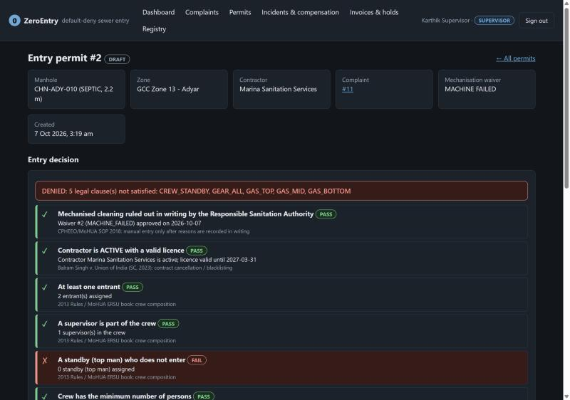

# ZeroEntry

[](https://github.com/Vyas-Vis06/DBThon-/actions/workflows/ci.yml)

**A default-deny database for sewer-entry safety, with shadow-entry detection by absence.** DBThon 2026 · VIT SCOPE · BCSE302P.

ZeroEntry links a municipal complaint/job record to database-owned permit decisions and reviewable evidence gaps.

* A permit becomes `AUTHORISED` only when all 11 configured clauses pass. Per-entrant gear division, depth-specific gas
  checks and a distinct crew explain each denial. New entry admission rechecks current conditions. Unsafe readings,
  revoked credentials and periodic expiry sweeps stop permits while preserving physical exits and violation evidence.
* SE1/SE2 detect missing expected evidence with resolution exemptions and a grace window. A machine outcome has its own
  server receipt time. Late evidence needs human review, and alerts create source-specific invoice holds.
* Invoice/payment locks and atomic incident consequences keep recorded financial decisions consistent. Immutable policy
  history and authorization snapshots preserve which values, citations and evidence supported a decision.

This is a tested software prototype over synthetic records. Source metadata separates law, court direction, guidance
and product policy. The seeded gear applicability, delegated approval, compensation defaults and physical response need
operator/domain review. [Policy and prior art](docs/POLICY_AND_PRIOR_ART.md) bounds the novelty claim.



## Quick start

You need **Python 3.11 or 3.12** and nothing else: no Docker, no PostgreSQL install (an embedded PostgreSQL 16 comes from pip).
On Python 3.13+ see [SETUP.md](docs/SETUP.md#requirements) first.

```bash
git clone https://github.com/Vyas-Vis06/DBThon-.git zeroentry && cd zeroentry
python -m venv .venv
source .venv/bin/activate              # Windows PowerShell:  .venv\Scripts\Activate.ps1
python -m pip install -e ".[dev]"
python scripts/dev.py                  # migrate, load demo data, serve http://127.0.0.1:8000/
```

Sign in as `supervisor@zeroentry.example` with the password `dev.py` prints, open the **DRAFT** permit and press
*Ask the database to authorise entry*: denied, with five reasons. The full three-minute story is in
[docs/development/DEMO_SCRIPT.md](docs/development/DEMO_SCRIPT.md); other logins, flags and troubleshooting in
[docs/SETUP.md](docs/SETUP.md).

```bash
python -m pytest -n auto               # about 500 tests in about 2 minutes; each test gets its own fresh database
```

## What is in the box

| Area | What | Verified by |
|---|---|---|
| Schema | 35 tables, enforced foreign keys, CHECK/UNIQUE/exclusion constraints, indexes, 13 forward-only migrations | `tests/db/test_schema.py`, generated [SCHEMA_REFERENCE](docs/SCHEMA_REFERENCE.md) |
| Entry gate | division, immutable parents, current admission, 90-minute stretches/30-minute rest, stop/exit events and tested concurrent decisions | `tests/db/test_entry_gate.py`, `test_entry_rules.py`, `test_concurrency.py` |
| Detection by absence | SE1 / SE2 anti-joins, grace window, idempotent scan, review with history, invoice holds with provenance | `tests/db/test_detection.py` (the six scenarios) |
| Consequences | `record_incident()` procedure, compensation payments, holds | `tests/db/test_consequences.py` |
| API | FastAPI, guarded operations, sessions, CSRF, lockout, six roles, scoped decision/event reads and row-level security | `tests/api/` (every endpoint × every role), `tests/db/test_rls.py` |
| UI | no-build browser UI, strict CSP | walked through by hand; `tests/api/test_web.py` (no headless-browser tests) |
| SQL showcase | joins, aggregates, search, division, anti-join, views, transactions, trigger refusals | `database/queries/`, each file run by `tests/db/test_demo_queries.py` |

CI runs the suite on Linux/Windows (Python 3.11/3.12), macOS (3.12), and a disposable PostgreSQL 16 service. A separate installed-wheel smoke checks the HTML/JS/CSS distribution.

## Repository map

| Path | Contents |
|---|---|
| `database/migrations/sql/` | the schema and every rule (PL/pgSQL), numbered and forward-only |
| `database/seeds/` · `database/queries/` | deterministic demo data · annotated demonstration queries |
| `src/zeroentry/` | the API (`routers/`, `deps.py`, `errors.py`, ...) and the browser UI (`web/`) |
| `tests/` | `unit/`, `db/` (SQL behaviour), `api/` (HTTP and roles) |
| `scripts/` | `dev.py` run everything · `db.py` migrate/bootstrap/new/reset · `seed.py` · `run_sql.py` · `gen_docs.py` |
| `docs/` | design, API, setup, testing, decisions, development log |

## Documentation

| Read | For |
|---|---|
| [PROJECT_SPEC.md](PROJECT_SPEC.md) | the problem, roles, business rules (`BR-nn`) and assumptions (`A-nn`) |
| [docs/ARCHITECTURE.md](docs/ARCHITECTURE.md) | components and the life of a request |
| [docs/DATABASE_DESIGN.md](docs/DATABASE_DESIGN.md) · [docs/ER_DIAGRAM.md](docs/ER_DIAGRAM.md) | why the schema looks like this (3NF analysis, gate, detection, locking) · ER diagrams |
| [docs/API_SPEC.md](docs/API_SPEC.md) | conventions, errors, and every endpoint with the roles allowed to call it |
| [docs/SETUP.md](docs/SETUP.md) · [docs/TESTING.md](docs/TESTING.md) | running it (embedded or a real PostgreSQL) · the test harness and what it proves |
| [SECURITY.md](SECURITY.md) | threat model, controls and the tests behind them, known limits |
| [docs/decisions/](docs/decisions/README.md) | architecture decision records |
| [ROADMAP.md](ROADMAP.md) · [docs/development/DEV_LOG.md](docs/development/DEV_LOG.md) | what is done and next · the latest state |
| [docs/development/AUDIT_RELEASE.md](docs/development/AUDIT_RELEASE.md) | audit findings, implemented corrections and handoff |

## Working on it (friends and their coding agents)

* **People:** [CONTRIBUTING.md](CONTRIBUTING.md) (workflow, PR checklist) and [AGENTS.md](AGENTS.md) (the rules).
* **Coding agents** (Claude Code, Codex, Cursor, Copilot): point them at [AGENTS.md](AGENTS.md); Claude Code also reads
  [CLAUDE.md](CLAUDE.md). A good first prompt: *"Read AGENTS.md, PROJECT_SPEC.md, ROADMAP.md and the latest entry of
  docs/development/DEV_LOG.md, then <task>. Run the whole test suite and report the real result."*
* The database is the authority: rules go in a new migration with a pass **and** a fail test, never only in Python.

## Evaluation and presentation

```bash
python scripts/evaluate_temporal.py --sizes 1000 10000 100000 --repeats 7
```

The [measured results](docs/evaluation/RESULTS.md) include synthetic precision/recall, query latency, persisted scan cost
and raw EXPLAIN plans. The baseline intentionally lacks temporal/applicability semantics, so it is not an equal-task
performance comparison. [Presentation brief](docs/development/PRESENTATION_BRIEF.md) supplies the problem, prior art,
contribution, evaluation limits and demonstration sequence.

## Before presenting

* Selected clauses have source/classification/applicability records. The configured gate is not a complete legal checklist.
  Avoid unreverified headline death statistics. Sources and assumptions are in
  [PROJECT_SPEC.md](PROJECT_SPEC.md) and [POLICY_AND_PRIOR_ART.md](docs/POLICY_AND_PRIOR_ART.md).
* All demo data is synthetic; no real person, contractor or licence is represented.
