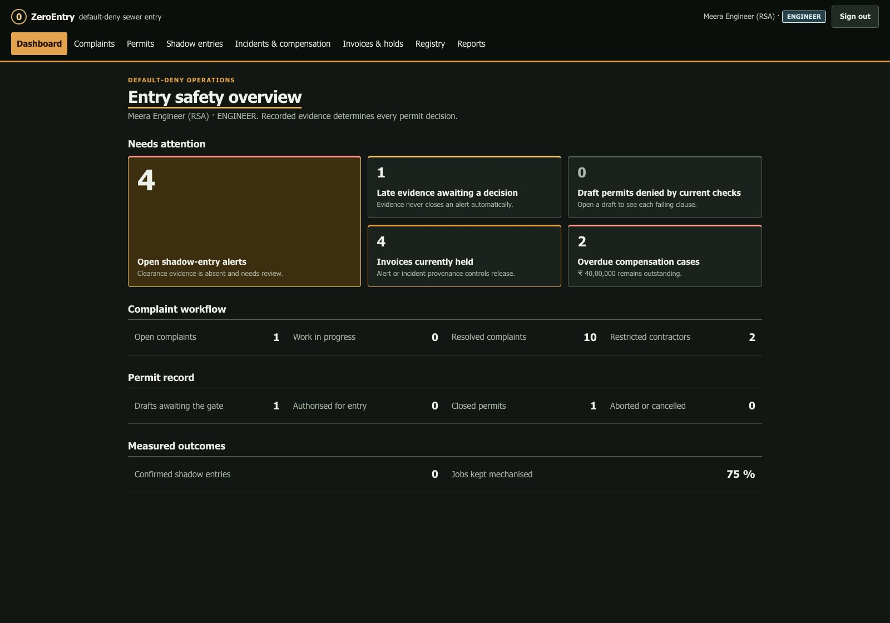
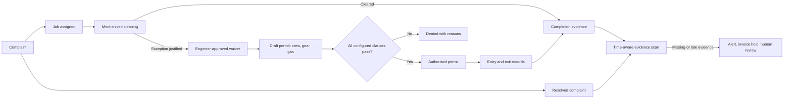
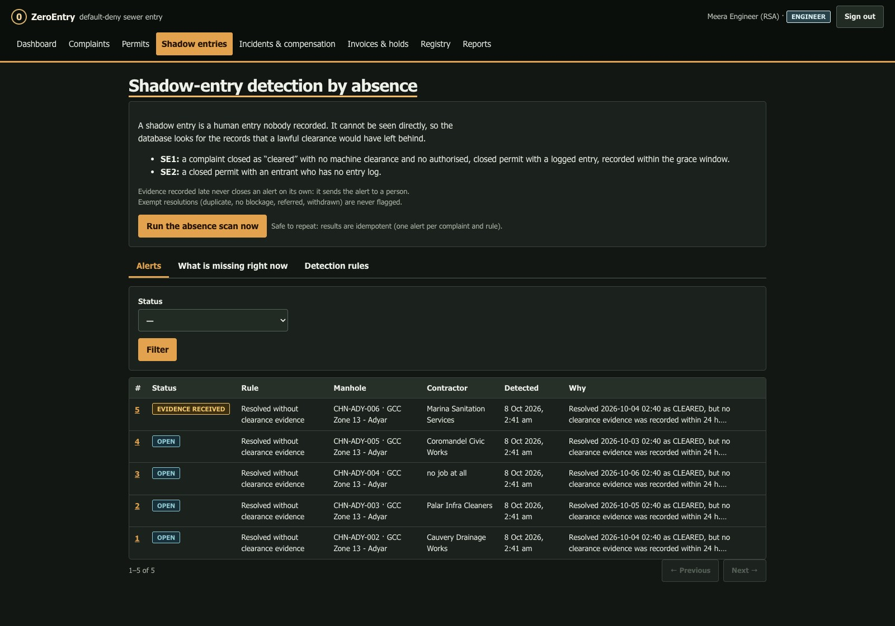
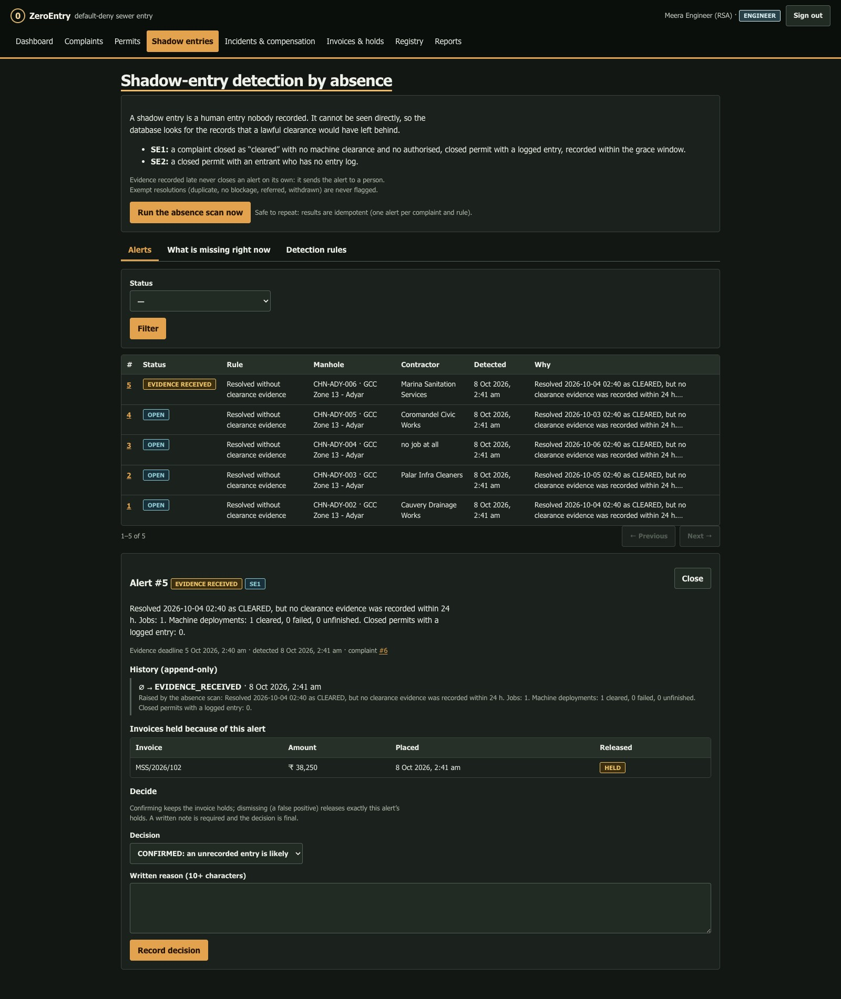
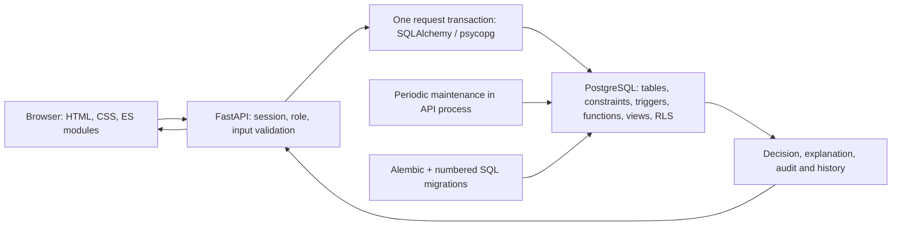

# ZeroEntry

[](https://github.com/Vyas-Vis06/DBThon-/actions/workflows/ci.yml)

### A complaint can be closed. The evidence should still answer for it.

**ZeroEntry connects sewer-work safety, completion evidence, and accountability in one PostgreSQL database.**
DBThon 2026 · VIT SCOPE · BCSE302P · Safety & Security.

Imagine a municipal sewer complaint marked **“cleared.”** A reviewer should be able to trace how it was cleared:
by a machine, or through an exceptional human-entry workflow with recorded safeguards. Without those records,
the status alone cannot answer whether the work followed the required process.

That gap affects sanitation workers, supervisors making entry decisions, municipal engineers reviewing work,
and auditors tracing responsibility. ZeroEntry makes the records part of the decision: it denies authorization
when configured safeguards are missing, flags missing completion evidence for human review, and connects those
alerts to invoice holds.

**Start here:** [spoken pitch](docs/PITCH_SCRIPT.md) · [run the demo](#quick-start) ·
[database handbook](docs/DATABASE_HANDBOOK.md) · [ER diagrams](docs/ER_DIAGRAM.md) ·
[all 35 tables explained](docs/TABLE_GUIDE.md) · [judge’s guide](docs/guide/README.md).



## The project in three decisions

| Question | What ZeroEntry does | Why the database matters |
|---|---|---|
| **May this worker enter?** | Mechanised-first workflow; exceptional entry needs a written, approved waiver. All 11 configured clauses must pass before a permit becomes `AUTHORISED`. New admission rechecks current conditions. | Constraints and triggers guard the stored transition, including a raw SQL update. Each failed clause has an explanation. |
| **What evidence supports “cleared”?** | SE1 checks eligible resolved complaints for timely machine or permit evidence. SE2 checks each entrant on a closed permit for an entry log. Exempt resolutions and a grace window distinguish legitimate absence from a gap. | Anti-joins and relational division start from explicit expected records; scans persist reviewable alerts without duplicates. |
| **What follows an unresolved concern?** | Alerts hold unpaid invoices. Late evidence goes to human review. Incident recording creates the configured compensation, sanction, and hold records atomically. | Transactions, source-specific holds, and locks keep related records consistent; dismissal releases only its own holds. |

“Zero-entry” is the mechanised-first goal and the default-deny permit workflow. “Shadow-entry” is a **suspected
unrecorded entry inferred from missing expected evidence**. An alert is a reason to investigate; it does not prove
that someone physically entered.

<details>
<summary>See the database deny a permit with five failed checks</summary>


</details>

## From complaint to accountable outcome



Unsafe recorded gas readings or revoked credentials can stop active permits. Periodic sweeps handle stale readings,
expiry, and overstays. Exits can still be recorded after a stop, preserving the reported physical history and
violation evidence. Recovery requires a fresh permit.

## Quick start

Install **Python 3.11 or 3.12**, then run:

```bash
git clone https://github.com/Vyas-Vis06/DBThon-.git zeroentry
cd zeroentry
python run.py
```

The launcher creates `.venv`, installs dependencies on first use, starts embedded **PostgreSQL 16**, applies all
14 migrations, loads synthetic demo data, and serves [the application](http://127.0.0.1:8000/).
No separate PostgreSQL install or Docker is needed for this route. API docs are at `/docs`; database health is at `/health`.
On macOS/Linux, use `python3.12 run.py` if `python` is unavailable. For a managed or native PostgreSQL server,
Python 3.13+, or manual installation, see [SETUP.md](docs/SETUP.md).

Sign in as `supervisor@zeroentry.example` using the generated password printed in the terminal. Open the **DRAFT**
permit on **CHN-ADY-010** and ask the database to authorise entry. The seeded permit fails five clauses; complete
the crew, missing gear, and fresh TOP/MID/BOTTOM readings to see the decision change.

Stop with **Ctrl+C**. Data survives restarts. Use a separate directory for rehearsal:

```bash
python run.py --data-dir .pgdata/judge-rehearsal --port 8010
```

Starting a worker’s entry uses the configured **06:00–18:00 IST** daylight window. Authorization and admission are
separate decisions; fresh gas readings are also time-sensitive. The [demo guide](docs/guide/README.md) explains
the steps and a clearly labelled synthetic evening rehearsal.

### Demo roles

All addresses end in `@zeroentry.example`; use the password printed by the launcher.

| Login | Role and purpose |
|---|---|
| `supervisor` | Prepare permits, crew, gear, readings, and entry/exit records |
| `engineer` | Approve waivers, review alerts, manage invoices and compensation |
| `worker` | View own permits and request stop-work |
| `contractor` | View own jobs, workers, permits, and invoices |
| `auditor` | Inspect permitted records and reports without writing |
| `admin` | Manage users, policy parameters, sources, and audit records |

## A short demonstration for judges

1. **Show the denied permit.** Explain the missing safeguards through the red/green clause checklist.
2. **Show authorization and its saved explanation.** Complete evidence and open the original decision artifact.
3. **Show an evidence gap.** Open a shadow-entry alert, its deadline, and its invoice hold. Explain why late
   paperwork still needs a reviewer.
4. **Show that the rules live in PostgreSQL.** Use the isolated showcase to demonstrate a refused raw SQL bypass,
   an atomic rollback, or a synchronized race.

The [pitch script](docs/PITCH_SCRIPT.md) supplies a problem-first spoken narrative, a short fallback, and a natural
transition into database details. For exact clicks and commands, use the [live demo script](docs/development/DEMO_SCRIPT.md)
and [terminal commands](docs/guide/DEMO_COMMANDS.md). The [conditions deck](docs/guide/ZeroEntry_Conditions.pptx)
explains the 19 showcase scenarios.

<details>
<summary>See the evidence-gap alerts and late-evidence review</summary>





</details>

These [screenshots](docs/img/README.md) show the current UI with synthetic demo records; each image was captured from
a running application. The [rehearsal cue card](docs/PITCH_CUE_CARD.md) condenses the spoken story and the screens to prepare.

```bash
# Independent throwaway databases; the app does not need to be running:
python run.py showcase
python run.py test
python run.py evaluate --sizes 1000 --per-class 5 --out -

# While the demo app is running, in another terminal:
python run.py sql database/queries/04_division_and_anti_join.sql
python run.py sql "SELECT status, count(*) FROM shadow_entry_alert GROUP BY status"
```

The showcase creates its own database copies and checks **19 conditions**, including gate refusal, unsafe-reading
stop, late evidence, holds, rollback, concurrency, and row-level security. Inspect the demonstration SQL before
running it on anything beyond disposable demo data; individual files manage their own transactions.

## Architecture: the application asks, PostgreSQL decides



| Layer | Technology | Responsibility |
|---|---|---|
| Interface | HTML, CSS, vanilla JavaScript ES modules | Safety operations console; no frontend build step or CDN |
| API | Python, FastAPI, Pydantic | Authenticate users, enforce endpoint roles, validate input, return database decisions |
| Data access | SQLAlchemy 2, psycopg 3 | Map SQL-defined tables, execute parameterized calls, commit before sending success |
| Database | PostgreSQL 16 in development; PostgreSQL 15+ supported | Referential integrity, gate and lifecycle rules, detection, transactions, RLS, history |
| Schema evolution | Alembic + 14 forward-only SQL migrations | Reproducible schema, reference data, and PL/pgSQL deployment |
| Verification | pytest, pytest-xdist, real PostgreSQL | Unit, database, API, documentation-drift, evaluation, and concurrency checks |

The runtime connects as **`ze_app`**, a least-privilege database role. Identity and row scope are set per transaction.
Contractors and workers see their own rows through PostgreSQL row-level security; endpoint guards apply the six
application roles. The database owner is a separate trusted administrative boundary.
See [ARCHITECTURE.md](docs/ARCHITECTURE.md) for the request sequence, maintenance, and runtime topologies.

## The database work behind the product

There are **35 application tables** (excluding Alembic’s version table). The schema separates operational facts,
expected requirements, financial consequences, identity, and retained evidence.

| DBMS concept | Concrete implementation | Read or demonstrate |
|---|---|---|
| ER modelling and normalization | Composite crew membership; normalized worker, contractor, complaint, and job records; deliberate historical snapshots | [ER diagrams](docs/ER_DIAGRAM.md), [table guide](docs/TABLE_GUIDE.md), [design and functional dependencies](docs/DATABASE_DESIGN.md) |
| Keys and integrity | PK/FK/UNIQUE/CHECK constraints; composite FKs bind gear and entries to permit crew | [Generated schema reference](docs/SCHEMA_REFERENCE.md) |
| Relational division | Every entrant must have every required configured gear item; SE2 checks every entrant’s log | [Division and anti-join SQL](database/queries/04_division_and_anti_join.sql) |
| Anti-joins and time | SE1 checks eligible complaints across all jobs; exemptions, grace, and final-outcome receipt distinguish missing and late evidence | [Database handbook](docs/DATABASE_HANDBOOK.md), [temporal tests](tests/db/test_temporal_evidence_and_invoice_races.py) |
| Functions, triggers, procedure, views | Explainable gate, guarded state transitions, incident consequences, reporting views | [Programmable objects](docs/DATABASE_DESIGN.md#7-programmable-objects), [SQL examples](database/queries/05_views_functions_procedures.sql) |
| Transactions and concurrency | Atomic incident recording; permit/evidence locks; serialized holds/payment; overlap exclusion | [Transaction demo](database/queries/06_transactions.sql), [concurrency tests](tests/db/test_concurrency.py) |
| Indexing and query plans | Latest-reading indexes, evidence lookup indexes, partial indexes, materialized parameter CTE | [Evaluation method](docs/EVALUATION.md), [measured results](docs/EVALUATION_RESULTS.md) |
| Security and audit | Least privilege, RLS, append-only histories, policy revisions, immutable authorization snapshot and SHA-256 digest | [SECURITY.md](SECURITY.md), [policy/source mapping](docs/POLICY_AND_PRIOR_ART.md) |

Start with the [database handbook](docs/DATABASE_HANDBOOK.md); use the [table guide](docs/TABLE_GUIDE.md) for the purpose
and relationships of every table, and the generated reference for exact columns, constraints, indexes, triggers,
and policies. [Standalone Mermaid files](docs/diagrams/README.md) are included for reuse in presentations.

## What has been measured

These are **published synthetic results**, not a new benchmark of the current checkout. The main run records commit
`7893c09`, Python 3.12.11, and PostgreSQL 16.2 on a local macOS machine. Exact results and workload definitions are in
[EVALUATION_RESULTS.md](docs/EVALUATION_RESULTS.md).

| Experiment | Published observation |
|---|---|
| Labelled evidence-gap cases | ZeroEntry: 80 TP, 0 FP, 0 FN, 120 TN; the stated naive query: 40 TP, 60 FP, 40 FN, 60 TN |
| Late paperwork after an alert | 20/20 cases remained under human review with their invoices held |
| Invalid database-write probes | 18/18 refused; the same schema with rule triggers disabled refused 1/18 |
| At 100,001 complaints in the main workload | Entry decision median **1.7 ms**; persisted scan median **254.9 ms** |

The separate [SE1 temporal experiment](docs/evaluation/RESULTS.md) uses a different six-category workload and reports
its own timings. Keep its numbers separate from the main run. Neither experiment establishes physical entry detection
accuracy, prevented injuries, or production latency. The naive query answers a simpler question; its runtime is not
an equal-task speed comparison. See [EVALUATION.md](docs/EVALUATION.md) for baselines and limits.

## Repository and documentation map

| Path | Contents |
|---|---|
| `run.py` | One-command launcher; dispatches `showcase`, `test`, `sql`, and other scripts |
| `database/migrations/sql/` | Authoritative schema, reference data, functions, triggers, views, and security |
| `database/seeds/` | Deterministic synthetic scenarios S0–S10 |
| `database/queries/` | Seven annotated SQL demonstrations: joins, aggregates, search, division, views, transactions, refusals |
| `database/evaluation/` | Synthetic history and comparison baselines, used only in throwaway databases |
| `src/zeroentry/` | API, authentication, transaction plumbing, ORM mappings, maintenance, and browser UI |
| `tests/unit/`, `tests/db/`, `tests/api/` | Unit checks, real SQL behavior and races, HTTP workflows and role checks |
| `docs/guide/` | Judge’s tour, demo commands, plain-language explanation, technical Q&A, conditions deck |
| `docs/diagrams/` | Standalone Mermaid ER and architecture source files |

| Need | Document |
|---|---|
| Rehearse the opening and technical transition | [PITCH_SCRIPT.md](docs/PITCH_SCRIPT.md) |
| Understand all database mechanisms | [DATABASE_HANDBOOK.md](docs/DATABASE_HANDBOOK.md) |
| Look up tables and relationships | [TABLE_GUIDE.md](docs/TABLE_GUIDE.md) · [ER_DIAGRAM.md](docs/ER_DIAGRAM.md) · [SCHEMA_REFERENCE.md](docs/SCHEMA_REFERENCE.md) |
| Inspect requirements and assumptions | [PROJECT_SPEC.md](PROJECT_SPEC.md) |
| Assess the DBThon submission | [SUBMISSION.md](docs/SUBMISSION.md): eight components, 30-mark rubric, SDG mapping, self-assessed TRL 4 |
| Run, test, or troubleshoot | [SETUP.md](docs/SETUP.md) · [TESTING.md](docs/TESTING.md) |
| Inspect API and security | [API_SPEC.md](docs/API_SPEC.md) · [SECURITY.md](SECURITY.md) |
| Review architecture choices and progress | [decisions](docs/decisions/README.md) · [ROADMAP.md](ROADMAP.md) · [development log](docs/development/DEV_LOG.md) |

## Before presenting

ZeroEntry is a working prototype over **synthetic records**, with typed or simulated gas readings. It enforces
recorded workflow state; field instruments, physical rescue response, and legal applicability require operator
and domain validation. Sources distinguish law, court directions, guidance, and product policy; the configured
gate and illustrative gear catalogue are not a complete legal certification.

The authorization digest verifies the saved artifact against its stored hash; it has no independent external
anchor. A privileged owner can alter the database. Engineer/supervisor access is not yet scoped per ULB, and
the browser UI has manual verification rather than automated browser coverage. Pilot and production work is
tracked in the [backlog](ROADMAP.md#backlog-not-started-not-required-for-the-demo).

## Contributing

Read [CONTRIBUTING.md](CONTRIBUTING.md) and [AGENTS.md](AGENTS.md). Business rules belong in PostgreSQL; migrations
are append-only. Regenerate schema/API docs after schema or endpoint changes with `python run.py gen_docs`, and
run `python run.py test`. Never commit `.env`, local database files, credentials, or real-person data.
