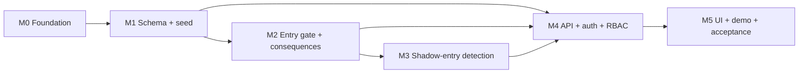

# ROADMAP

**Authoritative for:** what is built, what is next, dependencies, acceptance criteria, and who can work on what.
Requirements live in [PROJECT_SPEC.md](PROJECT_SPEC.md); history of decisions in [docs/development/DEV_LOG.md](docs/development/DEV_LOG.md).

Legend: `[ ]` not started · `[-]` in progress · `[x]` implemented **and verified by a test or command named in the row**.
A task is never `[x]` on "it compiles".

## Current state (2026-10-06): read this first

M0-M4 are implemented and verified by **492 passing tests** (`python -m pytest -n 6`). `[-]` means "implemented but not fully verified or not
finished", precisely:

* **M0-07 / M1-06:** README, PROJECT_SPEC, ROADMAP, AGENTS, CLAUDE, DEV_LOG and the generated `docs/SCHEMA_REFERENCE.md` exist. **Not written:**
  ARCHITECTURE, DATABASE_DESIGN, ER_DIAGRAM, API_SPEC, SETUP, TESTING, SECURITY, CONTRIBUTING, `docs/decisions/` ADRs.
* **M0-08:** `scripts/dev.py` was verified by running it; `scripts/db.py` (`bootstrap`, `new`, `reset`) has no test.
* **M5-01..05:** every screen is built and was **manually verified in a browser** (list in DEV_LOG); there are no automated browser tests.
* **M5-06:** `database/queries/06_transactions.sql` and `07_trigger_refusals.sql` demonstrate rollback and refusals (tested); the narrated
  `docs/development/DEMO_SCRIPT.md` and `scripts/demo.py` are **not written**. **M5-07, M5-08:** not started (also no `docker-compose.yml`).

Next step: write the missing documents (add a drift test as each lands), then M5-06..08. Details: [DEV_LOG.md](docs/development/DEV_LOG.md).
## Milestone map

Rule of thumb: **each milestone must run and pass its tests before the next starts.** Docs are updated in the same
milestone as the code they describe.

---

## M0 Foundation: runnable skeleton

| ID | Task | Status | Verified by |
|---|---|---|---|
| M0-01 | Git repository + `.gitignore` (no secrets, data or local settings tracked) | [x] | `git status` on a fresh clone |
| M0-02 | Packaging, pinned deps, venv | [x] | `pip install -e ".[dev]"` |
| M0-03 | Validated configuration (`config.py`), secret masking (`log.py`) | [x] | `tests/unit/test_config_and_errors.py` |
| M0-04 | Alembic + raw `.sql` migrations (`migrate.py`, `database/migrations/`) | [x] | `tests/db/test_foundation.py` |
| M0-05 | App factory, `/health` with real DB round-trip, central error mapping | [x] | `tests/db/test_foundation.py`, `tests/unit/...` |
| M0-06 | Test harness: embedded PG per session, template clone per test | [x] | every DB test |
| M0-07 | Documentation skeleton (all required files exist) | [-] | file list (filled in as features land) |
| M0-08 | `scripts/db.py` (migrate/bootstrap/new/reset) and `scripts/dev.py` (one-command run) | [-] | manual run documented in SETUP.md |

**Acceptance:** `python -m pytest` green; app starts; `/health` returns `database: up`.

## M1 Schema and seed data (needs M0)

| ID | Task | Status |
|---|---|---|
| M1-01 | Core tables, keys, CHECK/UNIQUE constraints, exclusion constraint (`0002`) | [x] |
| M1-02 | Reference data in migrations: roles, resolution types, legal clauses, detection rules, rule parameters, gear catalogue (`0003`) | [x] |
| M1-03 | Indexes for joins, filters and the detection anti-joins | [x] |
| M1-04 | SQLAlchemy 2.0 models mapped onto the SQL-defined tables; test that models match the reflected schema | [x] |
| M1-05 | Deterministic demo seed (3 Chennai zones, 60 manholes, 40 workers, 5 contractors, 2 detectors one expired) + users with a generated password | [x] |
| M1-06 | `DATABASE_DESIGN.md`, `ER_DIAGRAM.md`, drift test (tables in DB = tables in the doc) | [-] |

**Acceptance:** ≥ 8 related tables (target 30), every table has a PK, FKs and CHECKs reject bad data (tests),
seed is idempotent, models match the DB.

## M2 Entry gate and consequences (needs M1): the demo contract

| ID | Task | Status |
|---|---|---|
| M2-01 | Generic audit trigger; append-only `audit_log` | [x] |
| M2-02 | `rule_num()`, `permit_clause_check()` (division over gear and depth levels) | [x] |
| M2-03 | Permit state machine + **gate trigger** + `authorise_entry()`; raw `UPDATE ... SET status='AUTHORISED'` is refused | [x] |
| M2-04 | Crew/gear freeze, gas-reading triggers (calibration, append-only), entry-log triggers (window, daylight, 90 min) + overlap exclusion | [x] |
| M2-05 | Waiver triggers (approver role, `MACHINE_FAILED` needs a failed deployment), job-contractor guard | [x] |
| M2-06 | `record_incident()` procedure: case + blacklist + abort + holds, atomic; rollback test | [x] |
| M2-07 | Views: `v_permit_compliance`, `v_compensation_overdue`, `v_contractor_risk`, `v_invoice_status`, `v_ulb_year_kpi`, `v_ulb_year_incidents` | [x] |

**Acceptance:** every clause has a pass and a fail test; the gate cannot be bypassed; forced failure in
`record_incident()` leaves zero rows behind.

## M3 Shadow-entry detection by absence (needs M2)

| ID | Task | Status |
|---|---|---|
| M3-01 | Candidate views for SE1 (complaint-anchored anti-join) and SE2 (entrant division), `v_suspected_shadow_entry` | [x] |
| M3-02 | `shadow_entry_alert` + history, `scan_shadow_entries()` (idempotent upsert), lifecycle triggers | [x] |
| M3-03 | Invoice holds with provenance; release only by source | [x] |
| M3-04 | Six scenario tests: normal, missing, late, duplicate/conflicting, exempt, detected-then-resolved | [x] |

**Acceptance:** scan is idempotent; late evidence never auto-closes; dismissal releases only its own holds.

## M4 API, authentication, authorisation (needs M1; endpoints for M2/M3 as they land)

| ID | Task | Status |
|---|---|---|
| M4-01 | Sessions (opaque token, hashed in DB, HttpOnly SameSite=Strict cookie), login/logout, lockout, per-IP throttle, CSRF header | [x] |
| M4-02 | Request-scoped DB transaction with RLS context (`set_config(..., true)`); role guards | [x] |
| M4-03 | CRUD: ulbs, manholes, complaints, jobs, machines, workers, contractors, gear, detectors, invoices | [x] |
| M4-04 | Permit workflow endpoints (crew, gear, readings, clause checklist, authorise, entries, close, stop-work) | [x] |
| M4-05 | Detection endpoints (candidates, alerts, scan, review) | [x] |
| M4-06 | Incidents, compensation, holds | [x] |
| M4-07 | Reports, search and filters, pagination | [x] |
| M4-08 | Admin: users, rule parameters, audit log | [x] |
| M4-09 | RLS policies (contractor/worker scoping, auditor read-only) and tests. **Not claimed in docs until tested.** | [x] |

**Acceptance:** each role can do its permitted actions and is denied the rest (tests); no endpoint trusts the client for identity.

## M5 UI, demo, acceptance (needs M4)

| ID | Task | Status |
|---|---|---|
| M5-01 | Login, shell, dashboard (no build step, no CDN) | [-] |
| M5-02 | Complaints, jobs, waivers | [-] |
| M5-03 | **Permit wizard with red/green clause checklist** | [-] |
| M5-04 | Shadow-entry review screen, incident and compensation screens | [-] |
| M5-05 | Reports, admin | [-] |
| M5-06 | Scripted 3-minute demo + rollback demo (`scripts/demo.py`, `docs/development/DEMO_SCRIPT.md`) | [-] |
| M5-07 | Final acceptance pass against `docs/development/ACCEPTANCE_CHECKLIST.md` | [ ] |
| M5-08 | CI workflow (`.github/workflows/ci.yml`); **not executed in this environment** | [ ] |

---

## Who can work on what (after M1)

Interfaces: SQL objects and their signatures are in [DATABASE_DESIGN.md](docs/DATABASE_DESIGN.md); HTTP in [API_SPEC.md](docs/API_SPEC.md).
Agree on those two files and the streams do not collide.

| Stream | Owns | Needs first | Conflicts to avoid |
|---|---|---|---|
| A: Database | `database/`, `tests/db/` | M1 | Only add new numbered migration files; never edit an applied one |
| B: API | `src/zeroentry/` (except `web/`), `tests/api/` | M1 for models; M2/M3 signatures | `models.py` is shared: add, don't reorder |
| C: UI | `src/zeroentry/web/` | API_SPEC.md | none (static files) |
| D: Docs / QA | `docs/`, `*.md`, acceptance checklist | any | Update docs in the PR that changes behaviour |

## Backlog (not started, not required for the demo)

* ULB-scoped visibility for engineers and supervisors (extend RLS with `ulb_id`).
* Map view of manholes and alerts.
* Simulated gas-sensor feed instead of typed readings.
* Tamil-language UI strings.
* Signed permit PDF export.
* Rest-interval rule once the SOP states a length (assumption A-04).
