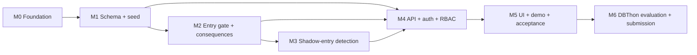

# ROADMAP

**Authoritative for:** what is built, what is next, dependencies, acceptance criteria, and who can work on what.
Requirements live in [PROJECT_SPEC.md](PROJECT_SPEC.md); history of decisions in [docs/development/DEV_LOG.md](docs/development/DEV_LOG.md).

Legend: `[ ]` not started · `[-]` in progress · `[x]` implemented **and verified by a test or command named in the row**.
A task is never `[x]` on "it compiles".

## ZE2 integration (2026-10-07): read this first

The original 574-test foundation has been independently verified. ZE2 extends it to 50 tables and 16
forward migrations while retaining its complaint-anchored evidence checks and financial race guards.
The integrated release passed 617 local tests, including three real-browser workflows, with no failures or skips.
Old milestone results below are historical. Current source-bound results are generated by `scripts/verify_release.py`
into `docs/evidence/current.json`; the judge screen refuses stale or missing results.

| Extension | Status | Required verification |
|---|---|---|
| Actual crew acknowledgements, seven readiness checks, complete gas evidence, serialized personal/site assets | [x] | Database gate, raw-write and concurrency tests |
| Immutable positive/negative receipts and revision/expiry recheck at admission | [x] | Database and API workflow tests |
| Explicit municipal completion matching, reference/projection reconciliation | [x] | Accountability API and clock-only projection tests |
| Standalone unregistered multi-victim reports, atomic pending assessments and retry safety | [x] | Incident API rollback/idempotency tests |
| Stored-principal ULB scope and durable incremental event replay | [x] | RLS, API and real-browser tests |
| Selected real-browser workflows, disconnected retry, polling cancellation and exit after stop | [x] | `tests/browser/test_workflows.py`: three passed |
| Same-predicate preview/write comparison and real logical backup/restore | [x] | `scripts/evaluate_preview.py`, `scripts/verify_restore.py` |

Adapted instructions for the three implementation lanes and the bounded novelty/demo story are in
[INTEGRATION_GUIDE.md](docs/development/INTEGRATION_GUIDE.md). Do not describe an educational passing
decision as permission for real hazardous entry. Production scope applicability and field evidence remain
outside this hackathon validation.

## Historical foundation and audit release

M0-M5 form the original implemented foundation. The audit hardening below adds three forward migrations (0012–0014),
bringing that historical release to 35 tables. Its UI verification was manual; ZE2 adds selected automated browser flows.
Earlier CI results describe the foundation; new branch CI results must be checked separately.

Upstream M6 adds the measured E1–E4 comparison, submission/rubric map and applied migration `0011`
([EVALUATION.md](docs/EVALUATION.md), [SUBMISSION.md](docs/SUBMISSION.md)). This release preserves its materialized parameter CTE optimization.

Changed in the second session: the full documentation set and its drift tests; a real concurrency bug in the entry gate found and
fixed (M2-08); Linux/macOS support for the embedded PostgreSQL (CI caught it); tests for `scripts/db.py`; the repository published
to GitHub with CI.

The legal/source review and bounded novelty analysis are in [POLICY_AND_PRIOR_ART.md](docs/POLICY_AND_PRIOR_ART.md).
Presentation claims and synthetic measurements are in [PRESENTATION_BRIEF.md](docs/development/PRESENTATION_BRIEF.md)
and [evaluation/RESULTS.md](docs/evaluation/RESULTS.md). Pilot work remains in the backlog below.

## Audit hardening and presentation release

| Task | Status | Verification |
|---|---|---|
| Immutable crew/gear parent IDs; continuing authorization; preserve exit after stop and violation evidence; statutory 30-minute rest | [x] | `tests/db/test_safety_lifecycle.py`, `test_entry_rules.py`, `tests/api/test_workflow.py` |
| Server receipt for machine finalization; serialized invoice holds/payment/source races | [x] | `tests/db/test_temporal_evidence_and_invoice_races.py`, `tests/api/test_temporal_evidence.py` |
| Classified sources, immutable policy revisions and authorization snapshots | [x] | `tests/db/test_policy_provenance.py`, `tests/api/test_decision_history_api.py` |
| Fresh server clock after authorization locks; runtime metadata grants tightened | [x] | `tests/db/test_integration_adversarial.py` |
| Automatic safety sweep and detection, with independent commits and bounded locks | [x] | `tests/db/test_maintenance.py` |
| Installed wheel includes shell and static UI | [x] | `scripts/check_wheel.py` against a separately installed wheel |
| Synthetic sensor demonstration using authenticated local API | [x] | `scripts/simulate_gas.py` run on isolated fresh demo data; unsafe BOTTOM reading stops permit; UI exit recorded after stop |
| PostgreSQL 16 service CI alongside existing OS matrix | [x] | all six jobs passed on audit build `28b8bee`; see branch Actions for the integrated head |
| Reproducible 1k/10k/100k synthetic evidence-gap evaluation with labelled baseline | [x] | `scripts/evaluate_temporal.py`, `docs/evaluation/results.json` |
| Original-decision, safety-history and policy-history screens | [-] | manually verified in browser; automated browser coverage pending |

## Milestone map

Rule of thumb: **each milestone must run and pass its tests before the next starts.** Docs are updated in the same
milestone as the code they describe.

---

## M0 Foundation: runnable skeleton

| ID | Task | Status | Verified by |
|---|---|---|---|
| M0-01 | Git repository + `.gitignore` (no secrets, data or local settings tracked) | [x] | `git status` on a fresh clone |
| M0-02 | Packaging, pinned deps, venv | [x] | `pip install -e ".[dev]"` |
| M0-03 | Validated configuration (`config.py`), secret masking (`log.py`) | [x] | `tests/unit/test_config_and_errors.py` |
| M0-04 | Alembic + raw `.sql` migrations (`migrate.py`, `database/migrations/`) | [x] | `tests/db/test_foundation.py` |
| M0-05 | App factory, `/health` with real DB round-trip, central error mapping | [x] | `tests/db/test_foundation.py`, `tests/unit/...` |
| M0-06 | Test harness: embedded PG per session, template clone per test | [x] | every DB test |
| M0-07 | Documentation set (all required files exist, links resolve) | [x] | `tests/unit/test_docs.py` |
| M0-08 | `scripts/db.py` (migrate/bootstrap/new/reset) and `scripts/dev.py` (one-command run) | [x] | `tests/db/test_db_script.py`; `dev.py` run from a fresh clone (2026-10-07) |
| M0-09 | Publish to GitHub; CI on Linux and Windows (Python 3.11, 3.12) and macOS (3.12) | [x] | `.github/workflows/ci.yml` (see the Actions tab) |

**Acceptance:** `python -m pytest` green; app starts; `/health` returns `database: up`.

## M1 Schema and seed data (needs M0)

| ID | Task | Status |
|---|---|---|
| M1-01 | Core tables, keys, CHECK/UNIQUE constraints, exclusion constraint (`0002`) | [x] |
| M1-02 | Reference data in migrations: roles, resolution types, legal clauses, detection rules, rule parameters, gear catalogue (`0003`) | [x] |
| M1-03 | Indexes for joins, filters and the detection anti-joins | [x] |
| M1-04 | SQLAlchemy 2.0 models mapped onto the SQL-defined tables; test that models match the reflected schema | [x] |
| M1-05 | Deterministic demo seed (3 Chennai zones, 60 manholes, 40 workers, 5 contractors, 2 detectors one expired) + users with a generated password | [x] |
| M1-06 | `DATABASE_DESIGN.md`, `ER_DIAGRAM.md`, drift tests (every table described and drawn; every drawn relationship is a real FK) | [x] |

**Acceptance:** ≥ 8 related tables (target 30), every table has a PK, FKs and CHECKs reject bad data (tests),
seed is idempotent, models match the DB.

## M2 Entry gate and consequences (needs M1): the demo contract

| ID | Task | Status |
|---|---|---|
| M2-01 | Generic audit trigger; append-only `audit_log` | [x] |
| M2-02 | `rule_num()`, `permit_clause_check()` (division over gear and depth levels) | [x] |
| M2-03 | Permit state machine + **gate trigger** + `authorise_entry()`; raw `UPDATE ... SET status='AUTHORISED'` is refused | [x] |
| M2-04 | Crew/gear freeze, gas-reading triggers (calibration, append-only), entry-log triggers (window, daylight, 90 min) + overlap exclusion | [x] |
| M2-05 | Waiver triggers (approver role, `MACHINE_FAILED` needs a failed deployment), job-contractor guard | [x] |
| M2-06 | `record_incident()` procedure: case + blacklist + abort + holds, atomic; rollback test | [x] |
| M2-07 | Views: `v_permit_compliance`, `v_compensation_overdue`, `v_contractor_risk`, `v_invoice_status`, `v_ulb_year_kpi`, `v_ulb_year_incidents` | [x] |
| M2-08 | Concurrency: evidence changes serialised with permit decisions (migration `0010`, `lock_permit()`); four races reproduced and closed | [x] |

**Acceptance:** every clause has a pass and a fail test; the gate cannot be bypassed; forced failure in
`record_incident()` leaves zero rows behind.

## M3 Shadow-entry detection by absence (needs M2)

| ID | Task | Status |
|---|---|---|
| M3-01 | Candidate views for SE1 (complaint-anchored anti-join) and SE2 (entrant division), `v_suspected_shadow_entry` | [x] |
| M3-02 | `shadow_entry_alert` + history, `scan_shadow_entries()` (idempotent upsert), lifecycle triggers | [x] |
| M3-03 | Invoice holds with provenance; release only by source | [x] |
| M3-04 | Six scenario tests: normal, missing, late, duplicate/conflicting, exempt, detected-then-resolved | [x] |

**Acceptance:** scan is idempotent; late evidence never auto-closes; dismissal releases only its own holds.

## M4 API, authentication, authorisation (needs M1; endpoints for M2/M3 as they land)

| ID | Task | Status |
|---|---|---|
| M4-01 | Sessions (opaque token, hashed in DB, HttpOnly SameSite=Strict cookie), login/logout, lockout, per-IP throttle, CSRF header | [x] |
| M4-02 | Request-scoped DB transaction with RLS context (`set_config(..., true)`); role guards | [x] |
| M4-03 | CRUD: ulbs, manholes, complaints, jobs, machines, workers, contractors, gear, detectors, invoices | [x] |
| M4-04 | Permit workflow endpoints (crew, gear, readings, clause checklist, authorise, entries, close, stop-work) | [x] |
| M4-05 | Detection endpoints (candidates, alerts, scan, review) | [x] |
| M4-06 | Incidents, compensation, holds | [x] |
| M4-07 | Reports, search and filters, pagination | [x] |
| M4-08 | Admin: users, rule parameters, audit log | [x] |
| M4-09 | RLS policies (contractor/worker scoping, auditor read-only) and tests. **Not claimed in docs until tested.** | [x] |

**Acceptance:** each role can do its permitted actions and is denied the rest (tests); no endpoint trusts the client for identity.

## M5 UI, demo, acceptance (needs M4)

| ID | Task | Status |
|---|---|---|
| M5-01 | Login, shell, dashboard (no build step, no CDN) | [-] |
| M5-02 | Complaints, jobs, waivers | [-] |
| M5-03 | **Permit wizard with red/green clause checklist** | [-] |
| M5-04 | Shadow-entry review screen, incident and compensation screens | [-] |
| M5-05 | Reports, admin | [-] |
| M5-06 | Narrated 3-minute demo, verified step by step on fresh data (`docs/development/DEMO_SCRIPT.md`); the rollback and refusal demos are `database/queries/06-07` (tested). A separate `scripts/demo.py` was dropped: it would duplicate both. | [x] |
| M5-07 | Final acceptance pass against `docs/development/ACCEPTANCE_CHECKLIST.md` | [x] |
| M5-08 | CI workflow (`.github/workflows/ci.yml`), green on GitHub Actions | [x] |

## M6 DBThon 2026 evaluation and submission (needs M5)

The brief is [docs/proposal/DBTHON2026_Challenge.pdf](docs/proposal/DBTHON2026_Challenge.pdf); what answers each part is in
[docs/SUBMISSION.md](docs/SUBMISSION.md).

| ID | Task | Status | Verified by |
|---|---|---|---|
| M6-01 | Evaluation harness `scripts/evaluate.py` with baselines in `database/evaluation/` (naive anti-join; rules in app code) | [x] | `tests/db/test_evaluation.py` (counts at a tiny scale, every CI run) |
| M6-02 | Full run at 1k, 10k and 100k complaints; results generated, method and limits written | [x] | [EVALUATION_RESULTS.md](docs/EVALUATION_RESULTS.md) (2026-10-07), [EVALUATION.md](docs/EVALUATION.md) |
| M6-03 | Fix found by the evaluation: detection views read the grace parameter once per statement (migration `0011`) | [x] | `test_detection_reads_the_grace_parameter_once_per_statement_not_once_per_row`; before/after columns in the results |
| M6-04 | Submission guide: the brief's eight components, five-step novelty, rubric map, SDG targets (checked on sdgs.un.org), TRL | [x] | [SUBMISSION.md](docs/SUBMISSION.md); links checked by `tests/unit/test_docs.py` |
| M6-05 | Statistics and legal references re-verified against their sources before presenting | [ ] | a person, not a test |

---

## Who can work on what (after M1)

Interfaces: SQL objects and their signatures are in [DATABASE_DESIGN.md](docs/DATABASE_DESIGN.md); HTTP in [API_SPEC.md](docs/API_SPEC.md).
Agree on those two files and the streams do not collide.

| Stream | Owns | Needs first | Conflicts to avoid |
|---|---|---|---|
| A: Database | `database/`, `tests/db/` | M1 | Only add new numbered migration files; never edit an applied one |
| B: API | `src/zeroentry/` (except `web/`), `tests/api/` | M1 for models; M2/M3 signatures | `models.py` is shared: add, don't reorder |
| C: UI | `src/zeroentry/web/` | API_SPEC.md | none (static files) |
| D: Docs / QA | `docs/`, `*.md`, acceptance checklist | any | Update docs in the PR that changes behaviour |

## Backlog (not started, not required for the demo)

* Broader automated browser coverage beyond the selected ZE2 workflows.
* Production-reviewed staff onboarding, scope allocation and cross-agency access governance.
* Map view of manholes and alerts.
* Authenticated physical instruments, calibration workflows and independently verifiable telemetry.
* Tamil-language UI strings.
* Signed permit PDF export.
* External anchoring/signing of decision artifacts and independent audit retention.
* Field validation of SE1/SE2 precision and alert review; missing records alone do not establish physical entry.
* More complete equipment applicability by task and shared versus individual equipment, reviewed with domain experts.
* Production monitoring, external notification delivery, crash-recovery drills and a legal/domain pilot review
  (the private logical restore demonstration is not production certification).
* Incremental absence scans if measured volumes outgrow the full pass.
