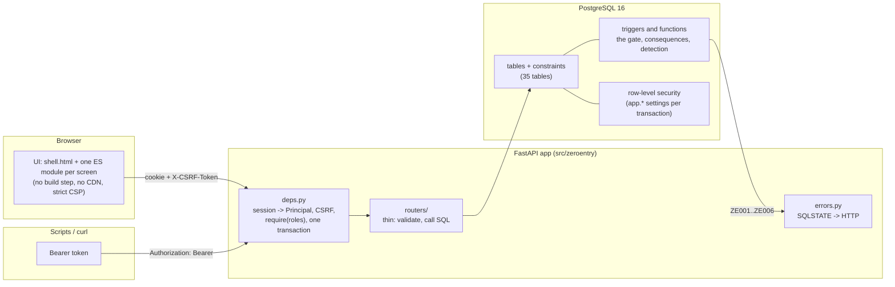
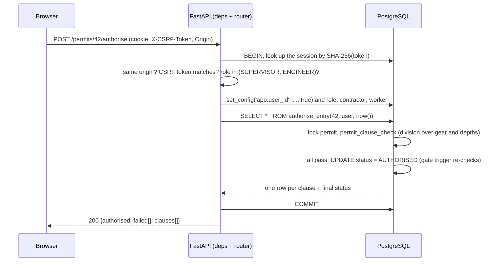

# Architecture

**Authoritative for:** the components, how a request flows through them, and where each responsibility lives. Requirements are
in [PROJECT_SPEC.md](../PROJECT_SPEC.md); the schema reasoning in [DATABASE_DESIGN.md](DATABASE_DESIGN.md); the choices and their
alternatives in [decisions/](decisions/README.md).

## The shape in one picture

**The database decides; the application asks.** Every business rule that can be stated over stored data lives in PostgreSQL, so
the same rule holds for the UI, a script, `psql` and any future client. The Python layer authenticates, authorises by role,
validates input shapes, and turns database refusals into readable HTTP errors.

## Components

| Component | Path | Responsibility |
|---|---|---|
| Schema and rules | `database/migrations/sql/0001-0014` | tables, constraints, triggers, functions, procedure, views, privileges, RLS (forward-only migrations run by Alembic) |
| Evaluation | `database/evaluation/`, `scripts/evaluate.py` | baselines and synthetic history for the measured comparison ([EVALUATION.md](EVALUATION.md)); throwaway database only, never migrated |
| Reference data | migration `0003` | roles, legal clauses, rule parameters, resolution types, detection rules, gear catalogue |
| Demo data | `database/seeds/`, `src/zeroentry/seed.py` | deterministic scenarios S0-S10 and demo logins (development only) |
| Configuration | `config.py`, `.env` | validated settings; production refuses insecure values |
| Request plumbing | `deps.py` | `get_db` (one transaction, committed before the response), `authenticate` (session lookup, CSRF, RLS context), `require(...)` (roles), paging |
| Routers | `routers/*.py`, `crud.py` | one module per area (auth, reference, complaints, permits, detection, money, reports, admin); `crud.py` builds the plain reference-table endpoints |
| ORM models | `models.py`, `views.py` | SQLAlchemy mappings onto the SQL-defined tables and views (a test checks they match the database) |
| Errors | `errors.py` | one envelope; SQLSTATE class `ZE` and integrity errors mapped to 4xx with the database's message |
| Security primitives | `security.py` | bcrypt, token generation and hashing, login throttle |
| UI | `web/shell.html`, `web/static/` | single shell; `app.js` (router, API client, DOM helpers); `pages/*.js` one per screen |
| Derived docs | `schema_doc.py`, `api_doc.py`, `scripts/gen_docs.py` | SCHEMA_REFERENCE.md and the endpoint table in API_SPEC.md, kept current by tests |

## A request, end to end

`POST /api/v1/permits/42/authorise` from the browser:

* The identity, role and scope come **only** from the session row; the four `app.*` settings are transaction-local, so they
  cannot leak to the next request on a pooled connection.
* The transaction commits **before** the response is sent (`Depends(get_db, scope="function")`): a 2xx always means durable.
* A refusal raised by a trigger (for example a 95-minute entry, `ZE002`) rolls the transaction back and becomes a 422 carrying
  the database's own sentence.

## Two database roles

| Role | Used by | Can |
|---|---|---|
| Owner (`postgres` in development, `MIGRATION_DATABASE_URL`) | migrations, seeding, `scripts/db.py` | everything; bypasses RLS |
| `ze_app` (`DATABASE_URL`) | the running application | only what the workflow needs: no DDL, no deletes of evidence, no writes to `audit_log`, column-level `UPDATE` rights; subject to RLS |

Functions that must cross role boundaries (`record_incident`, `audit_row`, `invoice_auto_hold`, `stop_work`, `lock_permit` and
the RLS helpers) run with owner rights and check the caller themselves.

## Periodic database maintenance

The API lifespan calls `sweep_permit_safety()` and `scan_shadow_entries(now())` at startup and every configured interval
(default 30 seconds). The database owns each decision. Per-task advisory transaction locks suppress overlapping ticks across
processes. Safety commits separately so a failed detection scan cannot roll back a stop; failures log and retry next tick.
Maintenance uses trusted service context with no fabricated human user, and safety/alert events remain durable in PostgreSQL.

New open entries always check current clauses, worker rest and the server clock. Gas/dependency writes revalidate affected
permits. The periodic sweep covers changes due to time alone, including stale readings, validity expiry and overstays.
Record exits on an already stopped permit and retain violation events. An API process or database outage delays sweeps;
this mechanism has no independent instrument or physical access-control channel.

## Runtime topologies

| Where | PostgreSQL | How it starts |
|---|---|---|
| Development | embedded PostgreSQL 16 from the `pgserver` wheel, data in `.pgdata/` | `python scripts/dev.py` (migrate, seed, scan, serve) |
| Tests | one embedded cluster per test session, one migrated template, a fresh clone **per test** | `python -m pytest` |
| Any real server (Docker or native PostgreSQL 15+) | your server | `python scripts/db.py bootstrap`, `python scripts/seed.py`, then `uvicorn --factory zeroentry.main:create_app` ([SETUP.md](SETUP.md)) |

PostgreSQL 15 or newer is required (`security_invoker` views). Neither `btree_gist` nor a time-zone database is needed.
