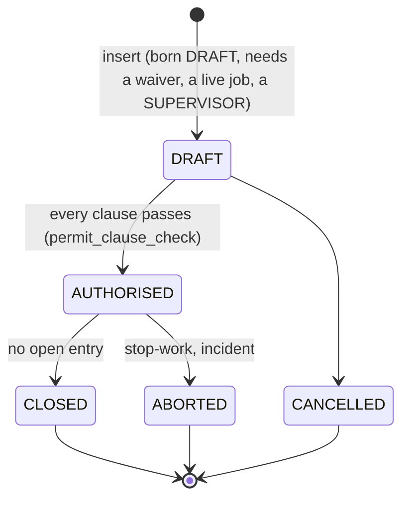
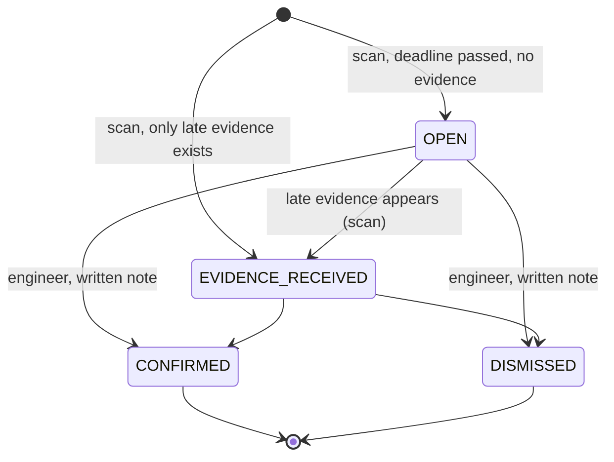

# Database design

**Authoritative for:** why the schema looks the way it does. *What* it contains, column by column, is generated from the live
catalogue in [SCHEMA_REFERENCE.md](SCHEMA_REFERENCE.md); the pictures are in [ER_DIAGRAM.md](ER_DIAGRAM.md); the SQL itself is
in [`database/migrations/sql/`](../database/migrations/sql/). Business-rule IDs (`BR-nn`) and assumptions (`A-nn`) refer to
[PROJECT_SPEC.md](../PROJECT_SPEC.md). A test fails if a table is added without being described here.

## 1. Principles

1. **The database is the authority.** Every rule that can be stated over stored data is enforced by PostgreSQL (keys, `CHECK`,
   exclusion constraint, triggers, functions, row-level security), so no client (the API, `psql`, a future mobile app) can
   bypass it. The API is a thin authenticated layer.
2. **Default deny.** An entry permit becomes `AUTHORISED` only when one function proves every clause; the same function guards
   the `UPDATE` itself (§5).
3. **Absence is a query.** "An entry nobody recorded" is found as the set difference between an explicit *expected population*
   and the records it should have left (§6).
4. **The law is data.** Thresholds, amounts, grace periods, legal clause titles and the gear catalogue are rows
   (`rule_parameter`, `legal_clause`, `gear_item`, `resolution_type`, `detection_rule`); changing one is audited.
5. **Evidence is append-only.** Gas readings, entry logs, waivers, incidents, alert history and the audit log cannot be
   rewritten or deleted.

## 2. Entities and relationships

Thirty-five tables, grouped by purpose. Core entities and their main relationships (cardinalities as drawn in ER_DIAGRAM):

| Group | Tables | Key relationships |
|---|---|---|
| Identity and access | `role`, `app_user`, `user_session` | role 1:N app_user; app_user 1:N user_session; app_user 0..1 : 0..1 worker (a WORKER login) |
| Organisations and people | `ulb`, `contractor`, `worker` | contractor 1:N worker |
| Assets and work | `manhole`, `machine`, `complaint`, `resolution_type`, `job`, `machine_deployment`, `mechanisation_waiver` | ulb 1:N manhole; manhole 1:N complaint; complaint 1:N job; contractor 1:N job; job 1:N machine_deployment; job 1:0..1 mechanisation_waiver |
| The entry gate | `entry_permit`, `permit_crew`, `gear_item`, `gear_issue`, `gas_detector`, `gas_reading`, `entry_log`, `legal_clause`, `rule_parameter` | job 1:N entry_permit; **entry_permit M:N worker through `permit_crew`** (with the attribute `crew_role`); permit_crew 1:N gear_issue; permit_crew 1:N entry_log; entry_permit 1:N gas_reading |
| Consequences | `incident`, `compensation_case`, `invoice`, `invoice_hold` | incident 1:0..1 compensation_case; job 1:N invoice; invoice 1:N invoice_hold; each hold has exactly one source (an alert **or** an incident) |
| Detection by absence | `detection_rule`, `shadow_entry_alert`, `shadow_entry_alert_event` | complaint 1:N alert (at most one per rule); alert 1:N event |
| Audit | `audit_log` | none, on purpose: history must outlive the rows and users it describes |

`permit_crew` is the heart of the model. It turns "the people on this permit" into rows with a composite key
`(permit_id, worker_id)`, and the tables that must only ever concern a crew member reference **that composite key**, not the
worker alone: `gear_issue`, `entry_log` and (when a permit is given) `incident`. So the database itself refuses gear issued to
someone who is not on the crew, or an entry logged for them.

## 3. Keys and constraints

* **Surrogate keys** are `bigint GENERATED ALWAYS AS IDENTITY` (clients cannot choose ids). **Natural keys** are still unique:
  `contractor.licence_no`, `worker.namaste_id`, `manhole.code`, `machine.code`, `invoice.invoice_no`, `app_user.email`,
  `gas_detector.serial_no`.
* **Code tables use the code as key** (`resolution_type.code`, `gear_item.gear_code`, `detection_rule.rule_code`,
  `legal_clause.clause_code`, `rule_parameter.param_key`), so stored references are readable and stable.
* **State consistency is a `CHECK`, not a convention.** Examples: a complaint is `RESOLVED` exactly when it has `resolved_at`
  and a `resolution_code`; a permit has `authorised_at`, `authorised_by` and `valid_until` all or none; a compensation case's
  `status` must match its payments; an invoice hold has exactly one source; a reviewed alert needs a reviewer and a note.
* **Exclusion constraint** `ex_entry_no_overlap` on `entry_log`: no two entries of the same worker may overlap in time. The
  equality half uses a single-point `int8range(worker_id, worker_id, '[]')` instead of `btree_gist`, so it works on any build.
* **Partial unique indexes** on `invoice_hold`: one hold per invoice per alert, and one per invoice per incident.
* **Composite FKs** through `permit_crew` (§2) and `incident (permit_id, job_id) → entry_permit (permit_id, job_id)`, so an
  incident cannot name a permit of a different job.

## 4. Normalisation (3NF) and the deliberate exceptions

**1NF.** Every column holds one value; nothing is a list. Crew, gear and readings are rows, not arrays. `entry_log.period`
is a `tstzrange`: one atomic value of a range type (PostgreSQL compares and indexes it as a unit), chosen so the overlap rule
is a constraint instead of a trigger.

**2NF.** The only tables with composite *primary* keys are `permit_crew (permit_id, worker_id) → crew_role`, where the role
depends on the whole key (a worker's role differs per permit). Tables whose natural key is composite use a surrogate key plus a
`UNIQUE` on the natural key, for example `gear_issue`: `issue_id → (permit_id, worker_id, gear_code, serial_no, issued_by, issued_at)`
with `UNIQUE (permit_id, worker_id, gear_code)`; `serial_no` depends on the whole natural key, not on part of it.

**3NF.** Non-key columns depend on the key and nothing else. The functional dependencies of the central tables:

| Table | Key → attributes | Transitive dependency avoided by |
|---|---|---|
| `worker` | `worker_id → contractor_id, full_name, namaste_id, medical_fit_until, trained_until, is_active`; `namaste_id → worker_id` | the contractor's name and status live in `contractor`, reached by FK |
| `complaint` | `complaint_id → manhole_id, description, raised_at, status, resolved_at, resolution_code, resolved_by` | the ULB is reached through `manhole`; whether a resolution needs evidence lives in `resolution_type` |
| `job` | `job_id → complaint_id, contractor_id, method, status, created_by, created_at` | the manhole is reached through `complaint` |
| `entry_permit` | `permit_id → job_id, supervisor_id, status, created_at, authorised_*, valid_until, ended_at, end_reason` | the contractor is reached through `job` |
| `gas_reading` | `reading_id → permit_id, detector_id, depth_level, o2_pct, h2s_ppm, lel_pct, co_ppm, taken_at, recorded_*` | calibration lives in `gas_detector` |
| `gear_item` | `gear_code → name, statutory, legal_ref` | statutory status is not copied into `gear_issue` |

**Deliberate exceptions, each guarded:**

| Column | Why it is stored | Why it is not an anomaly |
|---|---|---|
| `incident.contractor_id` | The employer **at the time** of the incident. Workers change contractor; the sanction and compensation must stay with the employer then. | It is a fact about the incident, not derivable later (a snapshot, not a copy). |
| `shadow_entry_alert.contractor_id`, `.reason`, `.evidence_deadline` | The evidence snapshot when the alert was raised. | Same: the alert must explain itself even after the data changes. |
| `compensation_case.status`, `complaint.status`, `entry_permit.status`, `invoice.status` | Derivable in part from other columns, kept for indexing and readable queries. | A `CHECK` ties each status to the columns it summarises, so they cannot disagree. |
| `user_session.csrf_token` | Per-session secret. | Depends only on the session key. |

## 5. The entry gate (zero-entry)



* `permit_clause_check(permit, at)` returns one row per clause (`MECH_WAIVER`, `CONTRACTOR_OK`, `CREW_*`, `CREW_FIT`,
  `GEAR_ALL`, `GAS_TOP/MID/BOTTOM`) with pass/fail and the failing detail. It is `STABLE` and takes the instant as a parameter, so
  it is reproducible in tests.
* **Relational division, twice.** `GEAR_ALL`: *there is no (entrant, statutory item) pair without a matching `gear_issue`*
  (`NOT EXISTS ... NOT EXISTS`), and it fails rather than passes vacuously when no statutory item is defined. `GAS_*`: for
  **each** of the three depths, the **latest** reading is fresh, in limits and from a detector calibrated that day (a later bad
  reading cannot hide behind an earlier good one).
* `authorise_entry()` locks the permit row (`FOR UPDATE`), evaluates once and returns the checklist either way. The
  `BEFORE UPDATE` trigger `permit_guard` calls the same check for **every** client, so a raw `UPDATE ... SET status='AUTHORISED'`
  is refused with SQLSTATE `ZE001`. An insert guard stops a permit being *born* authorised.
* After authorisation the crew and gear are frozen and the whole row is frozen outside `DRAFT` (except the legal transitions).
  `entry_log_guard` enforces the permit window, the `ENTRANT` role, daylight hours and the 90-minute limit; the exclusion
  constraint enforces no overlap.

## 6. Detection by absence (shadow-entry)

The expected population is explicit and the alert is the **anti-join** against the evidence it should have left:

```sql
-- SE1 (v_shadow_se1): complaints resolved as "cleared" with no timely clearance evidence on ANY of their jobs
SELECT ... FROM complaint c JOIN resolution_type rt ON rt.code = c.resolution_code AND rt.requires_evidence
WHERE c.status = 'RESOLVED'
  AND NOT EXISTS (machine deployment CLEARED, recorded within the grace window)
  AND NOT EXISTS (authorised permit CLOSED within the grace window with an entry logged within it)
```

`SE2` (`v_shadow_se2`) does the same per entrant of every closed permit. Evidence counts only if it was **recorded** (server
clock, `recorded_at`) within the grace window (`shadow_grace_hours`, A-06) after the anchor event, so candidates are a pure
function of the data and never race the scan schedule. Resolutions with `requires_evidence = false` are intentionally absent
(BR-33) and never appear.



`scan_shadow_entries(at)` is idempotent: `UNIQUE (complaint_id, rule_code)` plus `INSERT ... ON CONFLICT` means re-running
never duplicates, a dismissed alert is never re-opened, and **nothing is ever closed automatically** (BR-31). Opening an alert
holds the contractor's unpaid invoices on that complaint (`invoice_hold` with `alert_id`); dismissing it releases exactly those
holds, never an incident's.

**Cost.** The grace window is read once per statement: the one-row CTE `g` is `MATERIALIZED` (migration `0011`). Before that,
PostgreSQL inlined it and called `rule_num()` once per joined row inside the anti-join filters; at 100,000 resolved complaints
the scan ran 12x slower and the candidate query touched 2.7x more buffers, for identical results. The scan re-evaluates every resolved
complaint each time it runs (a full, idempotent pass; measured in [EVALUATION.md](EVALUATION.md)); an incremental scan driven by
a change queue is the upgrade path if volumes ever make that pass too slow.

## 7. Programmable objects

| Object | Kind | Purpose (rule) |
|---|---|---|
| `permit_clause_check`, `authorise_entry` | functions | the gate (BR-01..BR-08) |
| `permit_insert_guard`, `permit_guard`, `permit_delete_guard`, `freeze_after_authorisation` | triggers | born DRAFT, gate on UPDATE, state machine, freeze (BR-08, BR-09, BR-11) |
| `gas_reading_guard`, `entry_log_guard`, `waiver_guard`, `waiver_apply`, `job_method_guard`, `job_insert_guard` | triggers | calibration, entry window/daylight/90 min, waiver rules, sanctioned contractors (BR-02, BR-10, BR-12, BR-22) |
| `record_incident` | **procedure** | one atomic transaction: incident, compensation case and deadline, blacklist/suspend, abort/cancel permits, hold invoices (BR-20, BR-21) |
| `record_compensation_payment`, `release_invoice_hold`, `review_shadow_alert`, `stop_work` | functions | row-locked payments (no overpay), hold release by source only, alert decision, a worker's right to refuse |
| `invoice_guard`, `invoice_auto_hold` | triggers | an invoice on hold cannot be approved or paid; new invoices on a flagged job start held (BR-23) |
| `scan_shadow_entries`, `alert_guard`, `alert_after_insert`, `alert_after_update` | function, triggers | detection lifecycle, history, holds (BR-30..BR-36) |
| `audit_row`, `forbid_change` | triggers | audit trail on 20 tables; append-only evidence (BR-41) |
| `rule_num` | function | reads a rule parameter or fails loudly (`ZE005`) |
| `lock_permit` | function (owner rights) | serialises evidence changes with permit decisions (§8) |
| `v_permit_compliance`, `v_compensation_overdue`, `v_invoice_status`, `v_contractor_risk`, `v_ulb_year_kpi`, `v_ulb_year_incidents`, `v_shadow_se1`, `v_shadow_se2`, `v_shadow_candidate`, `v_suspected_shadow_entry` | views | readiness, overdue compensation, holds, risk score (weights A-10), zero-entry rate, detection |

All views are `security_invoker = true`, so they run with the caller's privileges and row-level security (a default view would
run as its owner and bypass RLS). Business-rule failures use a custom SQLSTATE class `ZE001..ZE006` that the API maps to HTTP
statuses ([API_SPEC.md](API_SPEC.md#errors)).

## 8. Transactions and concurrency

* The API runs **one transaction per request**, committed before the response is sent.
* `record_incident` is a procedure so that the six effects of a death are one unit; a test forces a failure after the incident
  row is written and checks that nothing remains (`tests/db/test_consequences.py`).
* **The proof cannot change while it is being decided.** `authorise_entry` locks the permit (`FOR UPDATE`), and every guard on
  crew, gear, readings and entries first takes `FOR SHARE` on the same permit row (`lock_permit()`, migration `0010`). A change to
  the evidence and a change of the permit's status are therefore serialised: whoever comes second waits, re-reads the committed
  state and is refused if it no longer holds. `tests/db/test_concurrency.py` reproduces the four races this closes (standby
  removed or an un-geared entrant added during authorisation, a raw `UPDATE` racing an uncommitted crew change, an entry
  started while the permit closes); each one committed before `0010`.
* Payments and hold releases lock their row (`FOR UPDATE`) so two clerks cannot overpay or double-release.
* The overlap rule is a constraint, so two concurrent inserts of overlapping entries cannot both succeed.
* [`database/queries/06_transactions.sql`](../database/queries/06_transactions.sql) demonstrates commit and rollback on the real
  consequence transaction, including a failure inside the procedure that leaves nothing behind.

## 9. Indexes

PostgreSQL does not index foreign keys automatically; every FK used in a join or a cascade has an index. Beyond those:

| Index | Serves |
|---|---|
| `ix_complaint_resolved` (partial, `status = 'RESOLVED'`) | the SE1 expected population |
| `ix_deployment_job_outcome`, `ix_permit_job (job_id, status)` | the SE1 anti-joins |
| `ix_reading_permit_depth (permit_id, depth_level, taken_at DESC)` | "latest reading per depth" in the gate |
| `ix_gear_issue_permit_worker` | the gear division |
| `ix_hold_active` (partial, unreleased) | "is this invoice on hold?" |
| `ix_manhole_code_prefix`, `ix_worker_namaste_prefix`, `ix_worker_name_prefix` (`text_pattern_ops`) | prefix search in the UI |
| `ix_alert_status`, `ix_complaint_status_raised`, `ix_audit_row`, `ix_audit_time` | list screens and the audit trail |

## 10. Security inside the database

The application connects as `ze_app`, which owns nothing, cannot `DELETE` evidence or touch `audit_log`, and has column-level
`UPDATE` rights only where the workflow needs them. Row-level security scopes `CONTRACTOR` and `WORKER` users to their own
rows; the user is passed per transaction with `set_config(..., true)`. Details and tests: [SECURITY.md](../SECURITY.md).

## 11. Time, migrations and reference data

* Instants are `timestamptz`. Local rules (daylight, "calibrated that day", year buckets) use `local_ts()`, `local_date()` and
  `from_local()` with a fixed +05:30 offset (A-07), so no time-zone database is needed.
* Migrations are numbered raw SQL files run by Alembic, forward-only; never edit an applied one
  (`python scripts/db.py new <name>` scaffolds the next). Reference data (roles, clauses, rules, parameters, gear) ships in
  migration `0003`; demo data is separate (`database/seeds/`).

## Audit hardening (0012–0014)

`permit_safety_event` retains immutable stop, overstay and exit-violation evidence. Its optional `entry_id` FK is deferred
so an event created in the entry transaction still requires the physical log row at commit. Crew/gear parent IDs are
immutable. New admission uses current conditions; closing an existing physical interval preserves reality after stop.
`machine_deployment.outcome_recorded_at` records finalization processing time separately from original row receipt and
reported event time. Legacy audit backfill cannot establish exact commit time; unproven outcomes remain NULL.

Invoice insertion and alert/incident creation take a complaint lock first. Hold placement then takes the invoice row lock
shared with approval/payment. Payment-first leaves an already-paid historical invoice without an active hold; hold-first
blocks payment. Regression tests run both interleavings and both source types, including invoice creation races.
These financial write paths require `READ COMMITTED` and reject other isolation levels with SQLSTATE `40001` before
writing. Waiting on a lock alone cannot refresh a repeatable-read snapshot; direct SQL callers must retry the entire
transaction at the supported isolation level. The API already uses `READ COMMITTED`.

`policy_source` stores immutable classifications and applicability. `legal_clause_source` links each clause to its relevant
sources. `rule_parameter_history` appends current-value revisions with a server timestamp, actor and written reason.
`permit_authorization_decision` stores one immutable successful-transition JSONB explanation plus a database-computed
SHA-256 of its PostgreSQL text rendering. Policy share locks keep active thresholds and the snapshot aligned. Runtime
authorization requires `READ COMMITTED`; stale snapshots of a draft's worker credentials otherwise survive permit locking,
so both the function and raw transition refuse other isolation levels with `40001`. Snapshot
JSON deliberately preserves historical values rather than normalizing them into mutable current rows. This is an explanation
artifact with a database-owner trust boundary, not a legal compiler or externally anchored signature.
