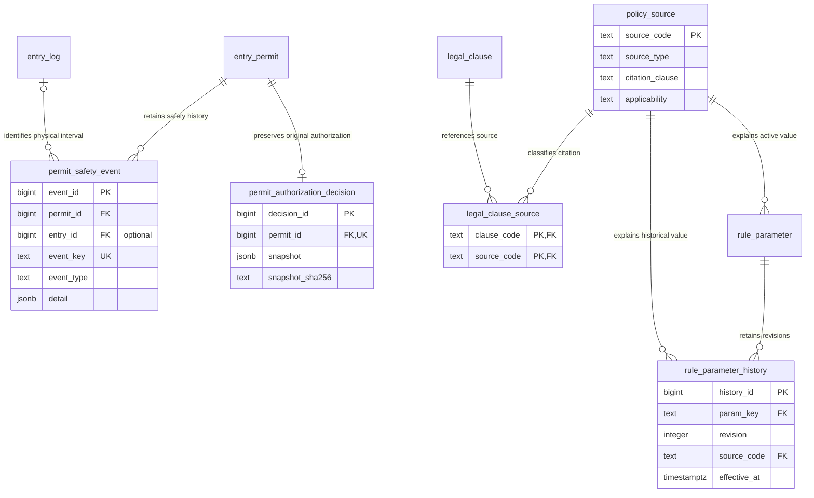
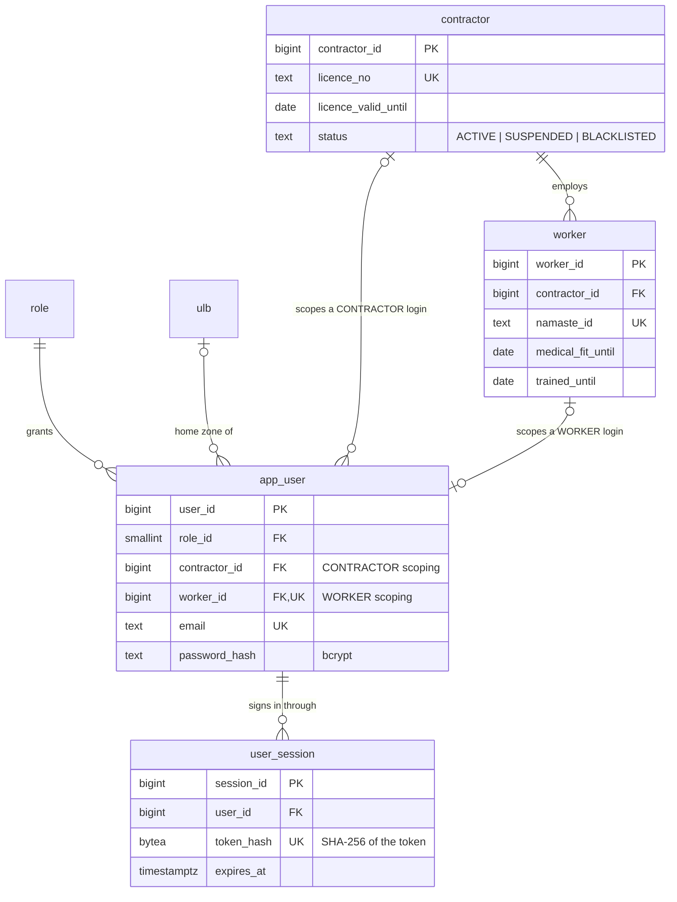
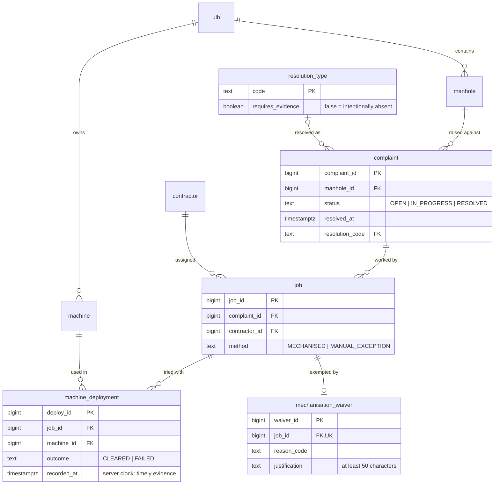
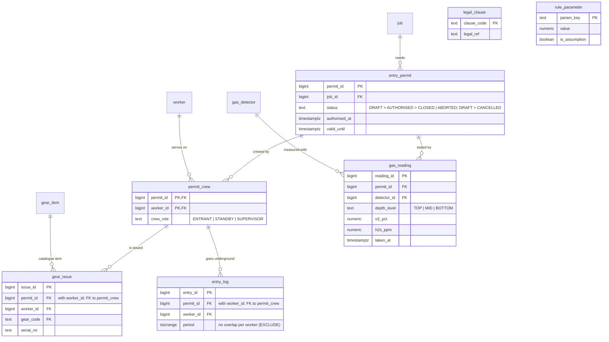
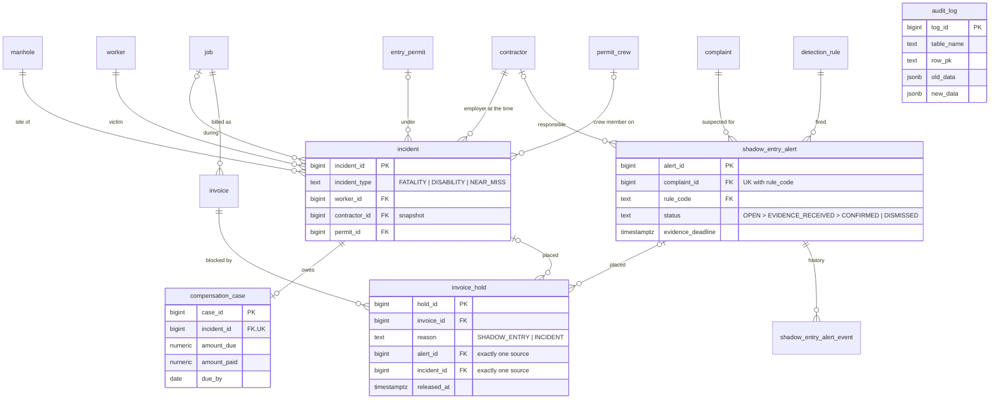

# ER diagrams

## ZE-2 evidence, replay and unregistered incident intake (0015–0016)

```mermaid
erDiagram
  ulb ||--o{ ulb_contractor_scope : "records governed allocation"
  contractor ||--o{ ulb_contractor_scope : "is allocated to scope"
  ulb ||--o{ ulb_detector_scope : "records instrument allocation"
  gas_detector ||--o{ ulb_detector_scope : "is allocated to scope"
  gear_item ||--o{ gear_asset : "classifies serial asset"
  ulb ||--o{ gear_asset : "owns serial inventory"
  gear_asset |o--o{ gear_issue : "identifies issued asset"
  entry_permit ||--o{ permit_site_gear : "assigns shared equipment"
  gear_asset ||--o{ permit_site_gear : "identifies shared asset"
  entry_permit ||--o{ permit_readiness : "retains readiness observations"
  entry_permit ||--o{ permit_resource_reservation : "occupies resources"
  worker |o--o{ permit_resource_reservation : "reserves actual crew"
  gear_asset |o--o{ permit_resource_reservation : "reserves serial asset"
  entry_permit ||--o{ permit_decision_receipt : "retains all decisions"
  permit_decision_receipt |o--o{ entry_log : "optionally binds supplied decision"
  ulb ||--o{ completion_claim : "identifies source scope"
  job |o--o{ completion_claim : "optionally matches external claim"
  job ||--o| completion_projection : "projects review gaps"
  ulb ||--o| outbox_scope_counter : "serializes scope sequence"
  ulb ||--o{ outbox_event : "retains committed notifications"
  ulb ||--o{ incident_report : "scopes standalone report"
  job |o--o{ incident_report : "optionally links registered work"
  entry_permit |o--o{ incident_report : "optionally links permission"
  contractor |o--o{ incident_report : "optionally links contractor"
  incident_report ||--o{ incident_report_victim : "records affected people"
  worker |o--o{ incident_report_victim : "optional registry identity"
  incident_report_victim ||--o| incident_assessment_case : "opens pending assessment"
  incident_report |o--o{ invoice_hold : "preserves report provenance"
  command_dedup {
    bigint dedup_id PK
    bigint actor_user_id FK
    text operation
    uuid idempotency_key
    text body_sha256
    jsonb response_json
  }
```

`command_dedup` references `app_user`; the identity edges remain omitted under the diagram convention below.
Outbox `entity_id` is a typed notification identifier, not an invented foreign key. Read the current generated schema
for complete constraints and optionality.

The tables are drawn in smaller diagrams that share entities. Column-level detail
(every type, constraint, index, trigger and policy) is in the generated [SCHEMA_REFERENCE.md](SCHEMA_REFERENCE.md); the reasons
behind the design are in [DATABASE_DESIGN.md](DATABASE_DESIGN.md).

**Kept in sync by a test** (`tests/db/test_docs_in_sync.py`): every table appears below, every relationship line is a real
foreign key, and every foreign key is drawn, except the "who did it" columns that point at `app_user`
(`created_by`, `recorded_by`, `approved_by`, `decided_by`, `reviewed_by`, ...), which are left out so the pictures stay readable.

Notation (crow's foot): `||` exactly one · `|o` zero or one · `o{` zero or more. GitHub renders these diagrams; elsewhere paste
them into <https://mermaid.live>.

## Safety evidence and decision provenance (0012–0014)

## 1. Identity, access and the organisations

## 2. Complaints, jobs and mechanised evidence

## 3. The entry gate: permits, crew, gear, gas, entries

`legal_clause` and `rule_parameter` have no foreign keys: the gate function `permit_clause_check()` reads them by key. They are
the law expressed as data (titles, legal references, thresholds).

## 4. Consequences and detection by absence

`audit_log` has deliberately **no** foreign key (history must outlive the rows and users it describes).

