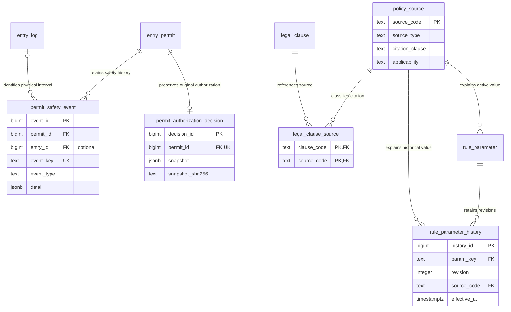
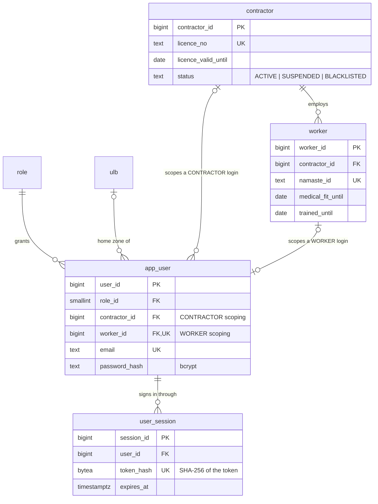
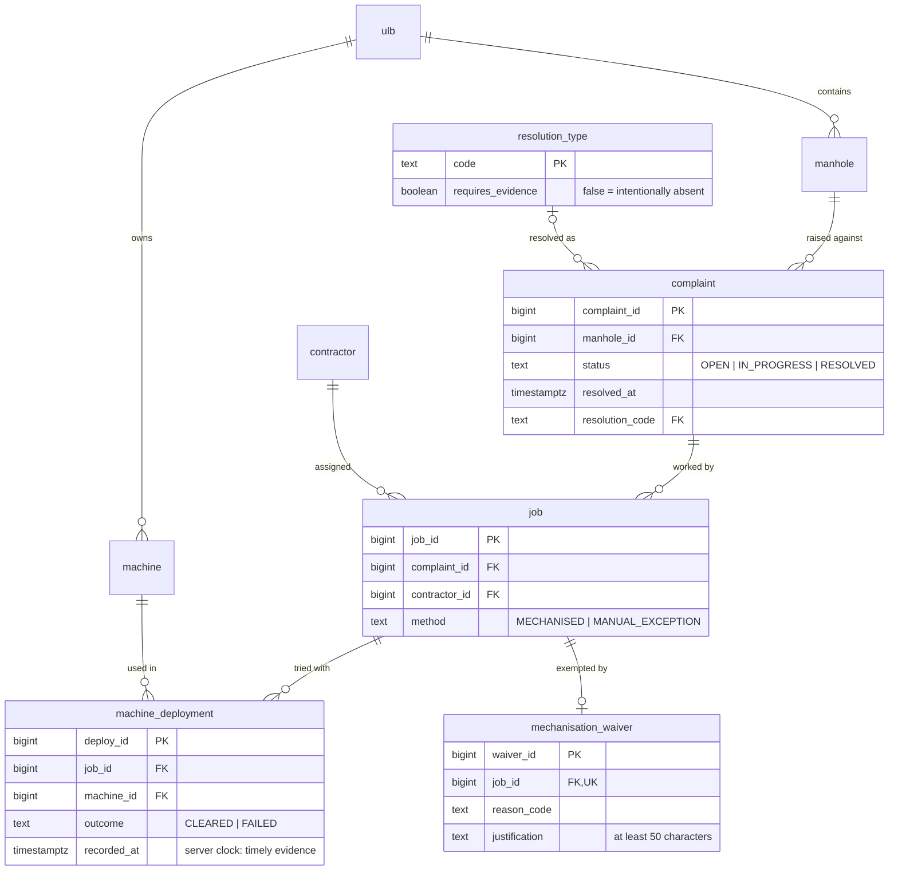

# ZeroEntry entity relationship model

This model covers the 35 application tables in migrations `0001`–`0014`. The sections below split the database by domain so
the relationships remain readable; the [single-page Mermaid source](diagrams/zeroentry-er.mmd) puts all 35 tables in one graph.
For exact column types, nullability, constraints, indexes, triggers and row-level security policies, use the generated
[SCHEMA_REFERENCE.md](SCHEMA_REFERENCE.md). The design rationale is in [DATABASE_DESIGN.md](DATABASE_DESIGN.md).

The ER diagrams are checked against the migrated catalogue by [`tests/db/test_docs_in_sync.py`](../tests/db/test_docs_in_sync.py):
each application table is named, each relationship line corresponds to a real foreign key, and every non-actor foreign-key
relationship appears. The diagrams omit action columns that reference `app_user` (such as `created_by`, `recorded_by`,
`approved_by` and `reviewed_by`) to keep the operational model legible. Account ownership/scope links and the required
`app_user` → `user_session` link remain visible. `audit_log.actor_user_id` is intentionally not a foreign key, so audit history
can outlive a user row.

Read each end's symbol as the allowed number of rows from that named table for one row at the opposite end. `||` means exactly
one, `|o` means zero or one, and `o{` means zero or more. For `manhole ||--o{ complaint`, every complaint points to exactly
one manhole, while a manhole may have no complaints or many. A nullable foreign key appears as `|o` beside its referenced
parent: the referencing child row may point to zero or one parent. A unique foreign key appears as `o|` beside the referencing
child: a parent can have at most one such child. Every connector is an enforced foreign key; a line does not mean that the
relationship is required in both directions.

## Table map

| Area | Tables | Count |
|---|---|---:|
| Identity and access | `role`, `app_user`, `user_session`, `ulb`, `contractor`, `worker`, `audit_log` | 7 |
| Complaints and mechanised work | `manhole`, `resolution_type`, `complaint`, `job`, `machine`, `machine_deployment` | 6 |
| Permit and safety evidence | `entry_permit`, `permit_crew`, `gear_item`, `gear_issue`, `gas_detector`, `gas_reading`, `entry_log`, `permit_safety_event`, `permit_authorization_decision`, `mechanisation_waiver` | 10 |
| Detection and review | `detection_rule`, `shadow_entry_alert`, `shadow_entry_alert_event` | 3 |
| Incidents and money | `incident`, `compensation_case`, `invoice`, `invoice_hold` | 4 |
| Policy and provenance | `legal_clause`, `policy_source`, `legal_clause_source`, `rule_parameter`, `rule_parameter_history` | 5 |
| **Total** | **35 application tables** | **35** |

## Safety evidence and decision provenance (0012–0014)

## 1. Identity, access and the organisations

## 2. Complaints, jobs and mechanised evidence

## 3. The entry gate: permits, crew, gear, gas, entries

`legal_clause` and `rule_parameter` have no foreign keys: the gate function `permit_clause_check()` reads them by key. They are
the law expressed as data (titles, legal references, thresholds).

## 4. Consequences and detection by absence

`audit_log` has deliberately **no** foreign key (history must outlive the rows and users it describes).

## How the records fit together

**From a complaint to a work decision.** A complaint belongs to one manhole and may have one or more jobs. A job is assigned to
a contractor. The machine-first path records machine deployments and their final outcome receipt. If a manual exception is
needed, the job may have at most one approved `mechanisation_waiver`; the database requires that waiver before a permit can be
drafted. A job can have multiple permit attempts, each with its own crew, issued gear, gas readings and entry records.

**From draft to safety evidence.** An `entry_permit` moves through `DRAFT → AUTHORISED → CLOSED`, or to `ABORTED` after
authorisation; an unused draft can become `CANCELLED`. The gate checks stored evidence before it allows the transition. A
successful transition creates one immutable `permit_authorization_decision` containing the clause results, relevant evidence
and policy revisions. Crew membership is a many-to-many relationship between permits and workers, implemented by
`permit_crew`; its composite primary key `(permit_id, worker_id)` makes one worker's role unique within a permit. `gear_issue`
and `entry_log` point back to that exact crew pair, so records cannot attach to a worker who was never assigned to that permit.
Safety stops, expiry and overstay evidence are retained in `permit_safety_event`.

**From an evidence gap to review.** Detection evaluates only its explicit expected population. A candidate creates a persisted
`shadow_entry_alert` for a complaint and rule; the unique `(complaint_id, rule_code)` key prevents duplicate alerts. Alert
changes are recorded in `shadow_entry_alert_event`. Late evidence can move an open alert to `EVIDENCE_RECEIVED`, which still
requires a reviewer. An alert hold and an incident hold both use `invoice_hold`, whose check requires exactly one source; an
invoice may have multiple holds, and each source governs its own release.

**From an incident to financial consequences.** An incident always identifies the worker, the contractor responsible at the
time, and the manhole. The contractor is stored as a snapshot because a worker's current contractor can change. Job and permit
context are optional. An incident may have at most one `compensation_case`; near misses need no case. `record_incident()` applies
the incident, contractor, permit and invoice consequences in one transaction.

**From policy to an explainable decision.** `policy_source` classifies citations; `legal_clause_source` links clauses and
sources many-to-many. Current `rule_parameter` rows are the inputs to the gate, and `rule_parameter_history` appends each
change with its source and reason. These rows preserve current configuration and its change history; they do not replay past
decisions. The schema does not add direct foreign keys from a permit to every policy row it reads; the immutable decision
snapshot preserves the policy and evidence used at authorization time.

## Keys and scope

`permit_crew` and `legal_clause_source` are composite-key bridge tables. `mechanisation_waiver.job_id`,
`permit_authorization_decision.permit_id` and `compensation_case.incident_id` are unique foreign keys, giving each parent zero
or one such child. The alert key `(complaint_id, rule_code)` is unique across the pair, so a complaint can still have alerts
for multiple rules. `invoice_hold` has optional `alert_id` and `incident_id` foreign keys; a row-level check makes the two
mutually exclusive and requires one to be present.

The drawings show relationships declared by foreign keys. They do not add implied links inferred from common IDs, trigger
logic or query joins. Each entity block highlights its key and selected domain fields; consult the generated schema reference
for the full table definition and for foreign keys to `app_user` that are omitted from the drawings.
