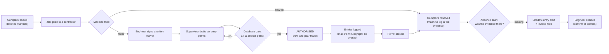
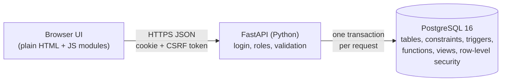

# ZeroEntry explained from zero

This page assumes you know nothing about the project, sewer work or database internals. It explains what problem we chose, what
we built, how the pieces fit, and what we are careful *not* to claim.

## 1. The problem in one paragraph

Indian cities clean blocked sewers and septic tanks through contractors. The law and official guidance say machines must be
used first. A person may enter a sewer only as an exception, with a written reason, a trained and medically fit crew,
protective gear for every person who goes down, and a gas test at the top, middle and bottom of the manhole. In practice these
checks often live on paper, after the fact, or not at all. When a complaint is closed as "cleared", nobody can easily tell
whether a machine did the job, or whether someone went down without a permit and nobody recorded it.

## 2. Our idea in two sentences

1. **Default deny.** Nobody is allowed into a manhole unless the **database itself** proves that every configured safety
   check is met. No screen, script or person typing SQL can skip that proof.
2. **Detection by absence.** A lawful clearance always leaves evidence: a machine log, or a closed permit with logged
   entries. So we compute the complaints whose evidence is **missing** and turn each one into an alert for a human to
   review. We call these **shadow entries**: entries that probably happened but were never recorded.

Then come the **consequences**. A death or injury triggers compensation, sanctions and payment holds in one all-or-nothing
step. Suspicious complaints freeze the contractor's unpaid invoices until a person decides.

## 3. The people (roles)

| Role | Real-world person | What they do in ZeroEntry |
|---|---|---|
| ENGINEER | the municipality's sanitation authority | approves "machine not possible" waivers and decides shadow-entry alerts |
| SUPERVISOR | the field supervisor | drafts permits, assigns crew, issues gear, logs gas readings and entries |
| CONTRACTOR | the cleaning company's office | sees only its own jobs, permits and invoices |
| WORKER | a sanitation worker | sees only their own permits, and can **refuse unsafe work** (stop-work) |
| AUDITOR | an inspector | reads everything, changes nothing |
| ADMIN | the system administrator | maintains policy values (each change needs a reason and is kept in history) and the audit log |

## 4. The life of one complaint

## 5. The three ideas, a little deeper

### 5.1 The entry gate (default deny)

A permit starts as **DRAFT**. It becomes **AUTHORISED** only through one SQL function, `permit_clause_check`, which
returns one row per check, each with PASS/FAIL and a human-readable reason:

* a written waiver exists (machine cleaning was ruled out),
* the contractor is active with a valid licence,
* the crew has at least one entrant, a supervisor, a standby who stays on top, and the minimum head count,
* everyone is medically fit and trained *on the day*,
* **every entrant holds every required gear item.** This is a classic database operation called **relational division**
  ("find entrants for whom no required item is missing"),
* **for each of the three depths, the latest gas reading is fresh, within limits and taken by a calibrated detector.** A
  later bad reading cannot hide behind an earlier good one.

The same check runs inside a **trigger** on the permit table. So even `UPDATE entry_permit SET status = 'AUTHORISED'`,
typed straight into the database, is refused with the list of reasons. After authorisation the crew and gear are **frozen**.
Entries are checked for the permit window, daylight hours, the 90-minute limit with a 30-minute rest, and no overlapping
entries for the same worker. The no-overlap rule is a database constraint, not code. A dangerous new gas reading, an
expired credential or the clock running out **stops** the permit automatically. A worker who is already inside can still
be recorded as exiting.

### 5.2 Detection by absence (shadow entries)

"Find something that did not happen" sounds impossible, but in a database it is a set difference:

> *expected* = complaints resolved as "cleared" (excluding resolutions that need no evidence, such as "duplicate" or "no
> blockage found")
> **minus** those with a timely machine log **or** a timely closed permit with a logged entry
> = **suspicious complaints**

That is an **anti-join** (`NOT EXISTS`). Two rules run: **SE1** per complaint, and **SE2** per entrant who was on a closed
permit but has no logged entry. Details that make it fair:

* a **grace window** (24 hours by default), so paperwork synced a few hours late is not punished;
* "timely" uses the **server's receipt time**, so nobody can back-date evidence;
* late evidence moves an alert to `EVIDENCE_RECEIVED` but **never closes it automatically**; a person decides;
* the scan is **idempotent**: running it again never duplicates an alert or re-opens a dismissed one.

Opening an alert **holds** that contractor's unpaid invoices for the complaint. Dismissing the alert releases exactly
*those* holds, and never a hold that came from an incident.

### 5.3 Consequences in one atomic step

`record_incident` is a database **procedure**. A single call records the incident, opens a compensation case with a deadline,
blacklists or suspends the contractor, stops their running permits and holds their invoices. If any part fails, **none** of
it happens. A test forces a failure halfway through and checks that nothing is left behind.

## 6. How the software is built

* **PostgreSQL decides; Python asks.** Every rule that can be stated over stored data lives in the database, so it holds
  for the UI, scripts and any future app alike.
* **The API** (FastAPI) handles login, sessions, which role may call which endpoint, input shapes, and turning database
  refusals into readable errors. Each request is one transaction, committed *before* the response is sent.
* **The UI** is plain HTML with one JavaScript module per screen: no build step, no CDN, and a strict content-security
  policy. It builds the page from text nodes only, which blocks HTML injection.
* **The database** has 35 tables created by 14 numbered migrations. Its rule failures use a custom error class (`ZE001` to
  `ZE006`) that the API maps to HTTP errors.

## 7. A map of the repository

| Folder | What is inside |
|---|---|
| `run.py` | the one command: sets up Python, then starts the database, API and UI |
| `database/migrations/sql/` | **the heart**: the schema and every rule, in 14 forward-only SQL files |
| `database/seeds/` | synthetic demo data (scenarios S0-S10) |
| `database/queries/` | seven annotated SQL files that demonstrate joins, division, anti-join, transactions and refusals |
| `src/zeroentry/` | the API (`routers/`, `deps.py`, `errors.py`) and the UI (`web/`) |
| `tests/` | about 570 tests: `unit/`, `db/` (SQL behaviour, races, refusals), `api/` (every endpoint for every role) |
| `scripts/` | `dev.py` (what `run.py` launches), `run_sql.py`, `evaluate.py`, `simulate_gas.py`, docs generators |
| `docs/` | design, ER diagrams, API, security, evaluation, decisions, and this guide |

## 8. How we know it works

* **Tests.** Each test runs on its own fresh copy of the database. They cover every rule with a pass case **and** a fail case,
  every endpoint for every role, real concurrent transactions racing each other, and raw-SQL attacks that skip the API.
  Result on this code: **574 passed**.
* **Measured evaluation** ([EVALUATION_RESULTS.md](../EVALUATION_RESULTS.md)), on labelled synthetic data:
  * detection precision and recall of 100 %, against 40 % and 50 % for a naive anti-join;
  * 18 of 18 invalid writes refused, against 1 of 18 when the same rules live in application code;
  * an entry decision in about 2 ms, flat from 1,000 to 100,000 complaints.

## 9. What we do **not** claim

* It checks **recorded evidence**, not physical reality. A typed gas value may be false. It is bound to a detector serial, a
  calibration date and a signed-in person, and it cannot be edited afterwards.
* All data is **synthetic**. There has been no field pilot, and accuracy figures are on labelled synthetic cases.
* The configured checks are selected rules with cited sources, **not a complete legal code**. Each check says whether it comes
  from law, guidance or our own product policy.
* We use established database techniques (division, anti-join, locks, row-level security). The contribution is **how they
  are combined** for this domain, not a new algorithm.
* A database superuser can disable triggers. Append-only protection holds against the application and its users, not
  against the server's owner.

Continue with [TECH_STACK_AND_GUARANTEES.md](TECH_STACK_AND_GUARANTEES.md) for the engineering detail, or
[JUDGE_QA.md](JUDGE_QA.md) for the questions.
