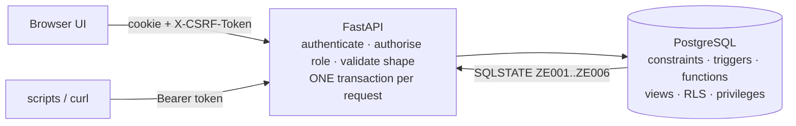

# Tech stack and guarantees

What ZeroEntry is built with, and how it handles atomicity, consistency, isolation, durability, concurrency, integrity,
security, auditability and performance. Every claim names the code that implements it and the test that proves it. For the
reasoning behind the schema, see [DATABASE_DESIGN.md](../DATABASE_DESIGN.md). For the threat model, see
[SECURITY.md](../../SECURITY.md).

## 1. The stack

| Layer | Technology | Why this and not something else |
|---|---|---|
| Database | **PostgreSQL 16** (any server 15+ works) | real transactions and row locks, `CHECK`, exclusion constraints on ranges, triggers, PL/pgSQL, row-level security, `security_invoker` views |
| Rules language | **PL/pgSQL** functions, triggers and one procedure | the rules sit next to the data, so every client obeys them |
| Embedded server | **pgserver** wheel (PostgreSQL 16 binaries from pip) | `python run.py` and the tests need no Docker or system install |
| Migrations | **Alembic** running **numbered raw `.sql` files** (`0001`-`0014`) | the schema is plain SQL a reviewer can read; forward-only, never `create_all()` |
| Data access | **SQLAlchemy 2** and **psycopg 3** | parameterised queries only; ORM models are checked against the live schema by a test |
| API | **FastAPI** (≥ 0.121), **uvicorn**, **pydantic 2** / pydantic-settings | typed input validation, OpenAPI docs at `/docs`, `Depends(..., scope="function")` to commit before responding |
| Passwords | **bcrypt** (cost 12) | slow, salted, standard |
| UI | plain **HTML + ES modules**, one module per screen | no build step, no CDN, strict CSP; DOM built from text nodes only |
| Tests | **pytest**, pytest-xdist, httpx | about 570 tests; a fresh database clone per test, run in parallel |
| CI | **GitHub Actions** | Linux and Windows on Python 3.11 and 3.12, macOS on 3.12, plus a real PostgreSQL 16 service container and an installed-wheel smoke test |

Scale of the schema: **35 tables** with their triggers, functions, the `record_incident` procedure and the views, two database
roles, and row-level security on tenant tables, all in 14 migrations. The generated column-by-column listing is in
[SCHEMA_REFERENCE.md](../SCHEMA_REFERENCE.md), and the object-by-object list in
[DATABASE_DESIGN §7](../DATABASE_DESIGN.md#7-programmable-objects).

## 2. Architecture rule: the database decides

Python authenticates the caller, checks the role, validates input shapes and translates refusals. **It does not re-implement
business rules.** Every rule that can be stated over stored data is enforced by PostgreSQL, so the UI, a script, `psql` and a
future mobile app all obey the same rule. The evaluation measures what this buys: with the same schema but the rule triggers
disabled ("rules in app code"), only **1 of 18** invalid writes is refused, against **18 of 18** with ZeroEntry
([EVALUATION_RESULTS.md](../EVALUATION_RESULTS.md), E2).

Refusals use a custom SQLSTATE class, mapped to HTTP in `src/zeroentry/errors.py`:

| SQLSTATE | Meaning | HTTP |
|---|---|---|
| `ZE001` | entry gate denied: a configured clause is not satisfied | 422 |
| `ZE002` | a recorded value breaks a rule (calibration, 90-minute limit, daylight, ...) | 422 |
| `ZE003` | not allowed in the current state (state machine, frozen crew, append-only table) | 409 |
| `ZE004` | referenced record not found | 404 |
| `ZE005` | rule parameter missing (misconfiguration) | 500 |
| `ZE006` | the actor's role may not perform this action | 403 |

## 3. ACID, property by property

### Atomicity: all or nothing

| Mechanism | Where | Proof |
|---|---|---|
| **One transaction per HTTP request**; any refusal rolls the whole request back | `deps.py` (`get_db`) | a trigger refusal aborts the transaction and becomes a 4xx with the database's own sentence ([ARCHITECTURE](../ARCHITECTURE.md#a-request-end-to-end)) |
| **`record_incident()` is a procedure**: the incident, compensation case and deadline, blacklisting or suspension, stopping permits and holding invoices happen as one unit | migration `0006` | `test_forced_failure_inside_the_procedure_leaves_nothing_behind`, `test_a_fatality_runs_the_whole_consequence_in_one_call` (`tests/db/test_consequences.py`) |
| Commit and rollback demonstrated live on the real consequence transaction | `database/queries/06_transactions.sql` | run by `tests/db/test_demo_queries.py`; try `python run.py sql database/queries/06_transactions.sql` |
| Authorisation is one function call: lock, evaluate, update and snapshot together, or nothing | `authorise_entry()` (`0005`, extended in `0014`) | `tests/db/test_entry_gate.py`, `tests/db/test_policy_provenance.py` |

### Consistency: invalid states cannot be stored

* **Keys.** Identity surrogate keys (clients cannot choose ids), with natural keys kept `UNIQUE` (licence number, NAMASTE
  id, manhole code, invoice number, e-mail, detector serial).
* **`CHECK` ties every status to its columns.** For example, a complaint is `RESOLVED` exactly when it has a resolution time
  and code, a permit has its authorisation fields all-or-none, and an invoice hold has exactly one source.
* **Composite foreign keys through `permit_crew (permit_id, worker_id)`.** Gear, entries and incidents can only reference
  someone who is actually on that permit's crew, and an incident cannot name a permit from another job.
* **Exclusion constraint `ex_entry_no_overlap`.** No two entries of one worker overlap in time. This is declarative, so even
  two simultaneous inserts cannot both succeed. It uses a single-point `int8range` in place of `btree_gist`, which keeps it
  portable.
* **Triggers for rules a constraint cannot express:** the gate, the permit state machine, frozen crew and gear, calibration,
  daylight, 90 minutes of work followed by a 30-minute rest, waiver rules, sanctioned contractors, and held invoices that
  cannot be approved or paid.
* **3NF**, with the functional dependencies analysed in [DATABASE_DESIGN §4](../DATABASE_DESIGN.md#4-normalisation-3nf-and-the-deliberate-exceptions).
  The only denormalised columns are deliberate *snapshots*, such as the employer at the time of an incident, each guarded by a
  `CHECK` or justified as historical fact.

### Isolation: concurrent requests cannot corrupt each other

The design choice is **`READ COMMITTED` plus explicit row locks**, not `SERIALIZABLE`.

* After a statement waits for a lock in PostgreSQL's `READ COMMITTED`, it re-reads the latest committed row, and every later
  statement takes a fresh snapshot. A "lock, then re-check" protocol therefore always decides on current data.
* Under `REPEATABLE READ` or `SERIALIZABLE`, the snapshot is fixed at the first statement, so waiting for a lock alone
  cannot refresh it. A transaction could then decide on stale credentials or a stale hold. The financial write paths
  (`0013`) and runtime authorisation by `ze_app` (`0014`) therefore **refuse any other isolation level with SQLSTATE `40001`**
  before writing. That is a retryable error, not silently stale data.
* The API always runs at `READ COMMITTED`. Direct SQL callers must retry the whole transaction at the supported level.

The lock protocol itself is described in section 4.

### Durability: a success means it is on disk

* **The transaction commits before the response is sent** (`Depends(get_db, scope="function")`). A 2xx therefore always
  means committed. This was a real defect, found and fixed: with FastAPI's default dependency scope, a failed commit could
  still have returned 200.
* PostgreSQL's write-ahead log makes committed data survive crashes. The embedded server keeps its data in `.pgdata/` across
  restarts.
* **Safety outlives detection.** The periodic maintenance commits the safety sweep separately from the absence scan, so a
  failed scan cannot roll back an already committed permit stop (`src/zeroentry/maintenance.py`;
  `tests/db/test_maintenance.py`).

## 4. Concurrency: the races we closed, and how

| Race | Protection | Proof |
|---|---|---|
| Crew or gear changed **while** a permit is being authorised | `authorise_entry` takes `FOR UPDATE` on the permit. Every crew, gear, reading and entry guard first takes `FOR SHARE` on the same row (`lock_permit()`, migration `0010`). Whoever comes second waits, re-reads and is refused if the proof no longer holds. | `test_crew_cannot_be_removed_while_authorise_entry_is_deciding`, `test_an_entrant_added_while_authorise_entry_is_deciding_is_refused_once_it_commits` |
| A raw `UPDATE ... AUTHORISED` racing an uncommitted crew change | same lock; the trigger re-checks after the wait | `test_a_raw_update_waits_for_an_uncommitted_crew_change_and_then_denies` |
| An entry started while the permit is being closed | same lock | `test_no_entry_can_start_while_the_permit_is_being_closed` |
| Two overlapping entries for one worker inserted at once | exclusion constraint (declarative) | `test_an_open_entry_blocks_overlaps_and_its_long_exit_is_retained`, `test_overlap_is_excluded_by_a_gist_exclusion_constraint` |
| Payment or approval racing a new shadow-entry or incident hold | fixed lock order: **complaint lock first, then the invoice row lock** shared with approval and payment. If payment commits first, the invoice stays paid without a hold; if the hold commits first, payment is blocked. Both orders are tested for both hold sources. | `test_payment_committing_before_a_source_hold_stays_paid_without_a_hold`, `test_source_hold_committing_before_approval_or_payment_blocks_it` |
| A new invoice created while its complaint is being flagged | the same complaint lock; a waiting invoice gets the committed hold | `test_invoice_creation_waiting_on_a_source_gets_that_source_hold` |
| Two clerks paying compensation at once (overpayment) | `FOR UPDATE` on the case in `record_compensation_payment` | `tests/db/test_consequences.py` |
| Re-running the absence scan, or two scans at once | `UNIQUE (complaint_id, rule_code)` plus `INSERT ... ON CONFLICT`: idempotent, never duplicates, never re-opens a dismissed alert | `tests/db/test_detection.py` |
| Two app processes running maintenance at the same tick | `pg_try_advisory_xact_lock` per task; overlapping ticks skip | `tests/db/test_maintenance.py` |
| The same death recorded twice | a unique constraint refuses the second (`23505`), leaving one compensation case | `test_the_same_death_cannot_be_recorded_twice` |

These race tests use **two real database connections** with synchronised interleavings, not mocks. Each of the four permit
races in `tests/db/test_concurrency.py` committed a wrong result before migration `0010` added the lock.

## 5. Security in depth

| Layer | Control |
|---|---|
| Accounts | bcrypt; at least 12 characters with mixed case and a digit; the same response and cost for an unknown e-mail and a wrong password; lockout after 5 failures (15 min); per-IP throttle |
| Sessions | opaque 256-bit token, only its SHA-256 stored; `HttpOnly; SameSite=Strict` cookie; server-side logout, expiry and revocation |
| CSRF | cookie writes need the per-session `X-CSRF-Token` **and** a same-origin `Origin` |
| Authorisation | every endpoint declares its roles with `require(...)`; a test probes **every endpoint for every role**; identity comes only from the session row, never from the client |
| Row-level security | contractors and workers see only their own rows. The user context is set per transaction with `set_config(..., true)`, so it cannot leak across pooled connections. No context means no rows. |
| Least privilege | the app connects as `ze_app`, which owns nothing, has no DDL, cannot delete evidence, cannot write `audit_log`, and has column-level `UPDATE` only (31 refused statements in `tests/db/test_privileges.py`) |
| Injection | parameterised queries and the ORM only; filters type-checked; the UI never uses `innerHTML`-style APIs (a test bans them) |
| Browser | CSP `default-src 'self'`, no inline script or style, `X-Frame-Options: DENY`, `nosniff`, `no-store` |
| Production | refuses to start with insecure settings; `/docs` disabled |

RLS is a **second** line of defence. Parameterised queries and least privilege are the first; see the limits in section 9.

## 6. Auditability and evidence

* **Audit trigger** on 20 tables. It records who changed what, before and after, and never stores password hashes. The audit
  log is **append-only**: even `DELETE FROM audit_log` is refused with `ZE003`.
* **Append-only evidence**: gas readings, entry logs, waivers, incidents, alert history and safety events cannot be updated or
  deleted.
* **Server-assigned receipt times** (`recorded_at`, `outcome_recorded_at`), so late paperwork cannot pretend to be timely.
* **Policy as data with history.** Thresholds, grace periods and amounts are rows. Each change appends a revision with the
  actor, server time and a required reason (`rule_parameter_history`, `0014`).
* **Authorisation snapshot.** Every successful authorisation stores an immutable JSONB record of the evidence IDs, policy
  revisions and source classifications used, plus a SHA-256 digest computed by PostgreSQL. A later policy change cannot
  rewrite *why* a past permit was allowed.

## 7. Time

All instants are `timestamptz`. Local rules ("daylight", "calibrated today", year buckets) use the helpers `local_ts()`,
`local_date()` and `from_local()`, with a fixed +05:30 offset. The embedded PostgreSQL ships without a time-zone database, and
India has no daylight saving. Gate functions take the instant as a parameter, so they are reproducible in tests.

## 8. Performance

| Technique | Effect |
|---|---|
| Every foreign key used in a join is indexed (PostgreSQL does not index them automatically) | joins stay index-driven |
| Partial index on resolved complaints, plus composite indexes for the anti-join and "latest reading per depth" | the gate and the scan read only what they need |
| `WITH g AS MATERIALIZED` for the detection parameters (migration `0011`, found by our own benchmark) | the grace window is read once per statement, not once per row: in the current results the candidate query and the scan are about 3x faster at 100,000 complaints, with identical results |
| Prefix indexes (`text_pattern_ops`) | fast "starts with" search in the UI |

Measured on one laptop ([EVALUATION_RESULTS.md](../EVALUATION_RESULTS.md), E3): an **entry decision in about 2 ms**, flat from
1,000 to 100,000 complaints at about 50 buffers. The **persisted absence scan has a median of about 0.25 s** at 100,000
complaints. Without its indexes, the same scan takes about 18 s. The supplementary temporal experiment
([evaluation/RESULTS.md](../evaluation/RESULTS.md)) uses a different, heavier workload, and records about 2.5 s for its first
scan at 100,000. Timings depend on the machine; the counts do not.

## 9. Known limits (stated, not hidden)

* The database enforces **state, not physics**. A typed gas reading can be false; it is bound to a detector, a calibration and
  a signed-in recorder, and it is append-only.
* A database **owner or superuser** can disable triggers or alter data. Append-only protection and the SHA-256 snapshot are
  integrity checks within the application's trust boundary, not externally anchored signatures.
* Time-based stops run on a **periodic sweep** (default every 30 s) while the app runs. Admission always re-checks current
  conditions.
* The per-IP throttle lives in process memory; the per-account lockout in the database is the authoritative control.
* No TLS inside the app: run it behind an HTTPS proxy with `COOKIE_SECURE=true`.
* Engineers and supervisors currently see every ULB. ULB-scoped visibility is on the backlog.
* Browser flows are verified by hand. There are no automated headless-browser tests yet.
