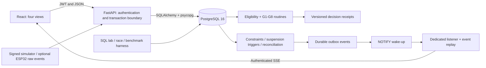

# ZeroEntry: consolidated implementation plan

Contract version: ZE-1.0. Prepared 7 October 2026. Status: implementation-ready design; application implementation and performance results are not yet verified.

## 1. Decision and contribution

Build **ZeroEntry: evidence-driven sanitation work control and accountability**. Domain: municipal sanitation, worker protection and civic accountability. Database: PostgreSQL 16. Application: FastAPI, SQLAlchemy 2, Alembic, React/Vite/TypeScript. Local Docker demonstration; simulated telemetry always available, existing ESP32 hardware a bounded secondary input path.

The contribution is a database protocol connecting **who actually participates, which evidence a decision used, whether that evidence remains valid, and whether completion and accountability records agree**. An evidence event changes the permit and its persisted notification in the same transaction. A reconciliation projection updates the affected job without rescanning all historical jobs. The prototype measures both correctness and the cost of these updates.

### Required five-part novelty statement

1. **Existing approach:** worker assignment and service-completion records; industrial systems additionally provide permit controls.
2. **Limitation:** the reviewed Garima PRD explicitly leaves assigned/actual-worker mismatch outside its scope; a static decision can also outlive its evidence in our conventional baseline.
3. **Proposed approach:** link acknowledged crew, current evidence, exclusive resources, versioned decisions and job-level reconciliation in PostgreSQL.
4. **Novel component:** the scoped municipal integration of expiring decisions, event-driven invalidation and an incrementally maintained evidence-gap projection with transactional consequences.
5. **Measurable benefit:** fewer inconsistent committed states and accountable completion gaps in controlled tests; measured incremental processing and notification latency. No numbers are claimed before execution.

Short pitch (53 words): Conventional records can identify assigned workers without establishing actual participation or current evidence. ZeroEntry connects participation, expiring decisions, resource reservations and completion reconciliation in PostgreSQL. Evidence changes invalidate permission and create durable events atomically. We measure inconsistent decisions, allocation conflicts and reconciliation cost against transparent baselines, while retaining mechanisation as the normal workflow.

Sources, counterexamples and boundaries are in [REVIEW_AND_EVIDENCE.md](REVIEW_AND_EVIDENCE.md). SQL assertions, temporal ranges, event processing, hashes and industrial permit blocking are prior art. An industrial product could implement similar controls through customisation; we do not claim global firstness.

## 2. Corrections that govern this plan

- The official challenge has **eight rows totaling 30 marks**. Page 4 contains TRL and Demonstration, worth 2. The old 28-mark discrepancy is resolved.
- The 23-item checklist is an internal/proposal target, not a separately established official minimum. We retain it because it supports implementation quality.
- The LAB and theory breadth is the professor's recommendation. We choose to implement all six LAB experiments and demonstrate or explain every theory topic; this is our delivery commitment, not a new organiser rule.
- Friend_progress contains research/planning prompts and incident notes, not application source, migrations, a working sensor rig or verified benchmark results.
- Team notes report a 7 October 14:00 to 8 October 14:00 IST event. This timing, finalist status and hardware availability are team-supplied, not confirmed by the challenge PDF. The runbook uses that deadline and a remaining-time schedule.
- Read the current official Rules alongside later orders. Numeric text verification does not establish that manual cleaning is permissible in a particular jurisdiction.
- No absence of a database record proves an unlawful act. Missing facts produce a review case; court/authority decisions remain external to this prototype.

## 3. Scope and the one headline feature

The headline is **a decision that remains valid only while its supporting evidence remains valid**. Supporting mechanisms: relational division, exclusive reservations, event-triggered suspension, incremental completion reconciliation, and atomic incident handling. The diagram and demo connect them into one job lifecycle.

### Required vertical slices

| Slice | User-visible result | Database mechanism | Owner | Release gate |
|---|---|---|---|---|
| S1 Mechanised job | Create complaint/job; block ineligible entry; record mechanical completion | FKs, state function, completion view | A+B+C | Clean-start API-to-DB flow |
| S2 Evidence decision | Missing reasons; acknowledged crew; individual/site gear; current samples; expiring receipt | Division, functions, versioned rules, constraints | A+B+C | G0-G8 positive/negative tests |
| S3 Changing conditions | New unsafe sample or refusal suspends permission; open entries remain visible | Immediate trigger, revision check, outbox, SSE | A+B+C | Commit/rollback and reconnect test |
| S4 Competing work | Two requests cannot occupy the same worker/asset | Scope lock, exclusion constraints | A+B | Two-session committed-state proof |
| S5 Closure accountability | Imported completed claim is reconciled; discrepancy and invoice hold reviewed | Indexed anti-join, per-job projection, guarded review | A+B+C | Projection equals reference query |
| S6 Incident | Incident and each victim's case, applicable holds and audit succeed together | CALL procedure, transaction, idempotency | A+B+C | Injected rollback and retry |
| S7 Faculty evidence | Six numbered SQL demonstrations; plans, concurrency, restore and measurements | Whole syllabus integration | All | Evidence manifest and rehearsal |

Implement the incremental ledger only after the reference anti-join is correct. Both remain in the final design so we can demonstrate equivalent answers. If the ledger is cut for time, use the indexed reference query, remove the incremental-performance claim, and retain the temporal integrity headline.

### Optional after the first complete flow

An ESP32 raw-event panel; certificate digest checking against a previously exported digest; one larger benchmark scale; useful additional accessibility. The simulator, event trigger, durable events and reconnect handling remain part of the core even without hardware.

### Deferred

Generic rule compilation, whole-statute implementation, Oracle migration, PostgreSQL upgrade, pg_ivm, pg_cron, Kafka, MQTT broker, Redis, Kubernetes, remote deployment, public map tiles, predictive AI, a second database, bitemporal history of every table, blockchain, Aadhaar collection, automated legal classification, subcontractor punishment propagation and field certification. Each adds work without resolving our central prototype question within the event.

## 4. End-to-end architecture

Use synchronous psycopg 3 sessions for short ordinary API transactions, plus a dedicated asynchronous psycopg connection for LISTEN. Never share a transaction/session across requests or keep a request transaction open while streaming. Use one API process for the local demo; document that multi-process fan-out needs additional coordination.

Authentication: seeded local users with Argon2 hashes and short-lived JWT access tokens; tokens in browser memory. Refresh tokens and self-service registration are deferred. Validate issuer, audience, expiration and algorithm. Retrieve current account role/scope from the database; do not accept the client's role field. Bind Docker ports to localhost, except an explicitly chosen LAN ingress for an already available board. Do not publish the DB port to the LAN.

### Workflow

Complaint -> asset -> job -> G0 eligibility -> mechanical work and evidence -> validated completion -> invoice review.

Only the isolated EDU_LAB policy exercises exception review -> crew acknowledgment -> readiness/gear/gas -> decision receipt -> entry-start recheck -> entry/exit or suspension -> completion. The real-city Chennai manual-cleaning profile denies the activity. A machine failure never changes that profile into permission.

External completion claim -> job match -> reconciliation -> unresolved gap/hold or consistent result. Recording an incident does not require inventing a job, permit, registered worker or contractor.

## 5. Roles and boundaries

| Actor | Read | Write/action | Explicit restriction |
|---|---|---|---|
| ADMIN | Own municipality setup and operational records | Accounts/reference data through approved routines | Cannot activate educational policy in a real scope or rewrite evidence |
| RSA | Own municipality dossiers and reviews | Approve an eligible educational exception; reconcile/review/release hold | Cannot override G0, missing evidence or physical resource conflict |
| SUPERVISOR | Assigned jobs, crew and evidence | Assign crew, submit readiness, request decisions, log entries/exits and completion; gas ingestion uses the separately authenticated device path | Cannot sign their own RSA waiver or act as an unacknowledged worker |
| WORKER | Own assignment/decision and relevant conditions | Own acknowledgment and refusal/stop-work | Cannot approve permit or change gas values |
| CONTRACTOR | Own jobs, invoices and limited crew display | Create draft invoices for own jobs; job creation and completion-claim import remain supervisor/admin and admin/RSA actions respectively | No access to another contractor's data, health detail or approval routines |
| AUDITOR | Scope-limited redacted read models, evidence and case status | None | No routine with mutation privileges |
| DEVICE principal | Its ingestion acknowledgment | Signed event ingestion for its bound permit/device | No interactive user authority or policy edits |

The service credential is trusted middleware, not a user credential. Transaction-local actor settings support RLS only within that boundary. A stolen shared service credential could impersonate context; do not present RLS as protection against that. Direct-SQL tests establish denial of forbidden table writes and persistence invariants for the restricted app role. An owner/superuser remains outside the tamper guarantee.

## 6. Deliberately simple concurrency design

ZE-1.0 serializes operational writes within each municipality by locking its existing `ulb` row first. Every public mutation routine, device-ingestion routine, policy activation, evidence correction, watchdog batch and projection rebuild participates. Workers/assets cannot be allocated across municipality scopes in this prototype. This explicit restriction makes the lock boundary meaningful.

After the scope lock, acquire any permit/resource rows in ascending ID order; capture `clock_timestamp()` after waiting. Use short READ COMMITTED transactions and fresh queries after the lock. Do not cache a pre-lock eligibility result. Exclusion constraints on occupied ranges provide a second invariant layer. This favours a straightforward correctness argument and predictable integration; throughput per municipality is an acknowledged limit measured in E2.

Use SERIALIZABLE only for the separate SSI comparison, with whole-transaction retry. Deferred triggers validate final structural states; they are not substitutes for synchronization and never reject an adverse observation merely to preserve an ACTIVE label. See the full protocol in [ROUTINES_AND_INVARIANTS.md](ROUTINES_AND_INVARIANTS.md).

## 7. Team allocation and implementation budget

Preserve the friend's four human areas without creating a fourth implementation worker:

| Human | Account packet | Ownership |
|---|---|---|
| Lead / former M2 | `prompts/LEAD_COORDINATOR.md` | Domain, verified seeds, contracts, root configuration, integration, source register, final claims |
| DB / former M1 | `prompts/WORKER_A_DATABASE.md` | Schema, migrations, routines, lab SQL, normalisation, DB proof |
| API / former M3 | `prompts/WORKER_B_BACKEND.md` | Backend/auth, simulator/device adapter, SSE, integration tests and measurements |
| UI / former M4 | `prompts/WORKER_C_FRONTEND.md` | Four views, client contract, charts, demo assets and presenter script |

These are provider-independent packets for the available sessions. The lead can run the supplied planning material manually or use an available account. Shared context lives in the repository, not in account memory. Repetitive extraction and consistency review may use GPT-6 Luna; no Astra subagents are required.

DB is the critical path. Bootstrap references and skeleton migrations first; B and C use the same checked-in JSON fixtures immediately. Return early PRs rather than one overnight branch. The lead and UI owner prepare evidence/presentation while B runs benchmarks, so DB is not also responsible for every report.

## 8. Definition of done

1. A clean local startup applies one migration head and seeds a labelled demo dataset.
2. The four-view flow exercises real DB results; no hidden mock fallback remains in live mode.
3. All six exact LAB experiments execute; the procedure is CALL-based and the cursor has a demonstrated caller.
4. G0-G8, expected denial reasons, revision changes, scope isolation, concurrency, adverse-event commit, incident rollback and duplicate retry tests pass.
5. Full/reference and incremental reconciliation agree on the same data; absence is labelled a discrepancy.
6. Results include commands, commit, configuration, data sizes and raw outputs. No placeholder number is presented as measured.
7. Backup/restore has run in a disposable database; the main demo revision and a recording are retained.
8. Each rubric row has visible evidence. TRL is stated conditionally from completed tests, not upgraded because a sensor is plugged in.
9. Each human can explain their own query, invariant and trade-off.

The remaining documents are binding ZE-1.0 contracts and work instructions. Their test commands describe the application to be built; they are not claims that it already exists.
