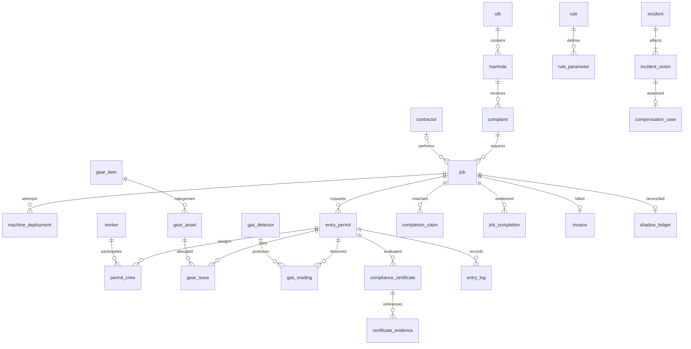

# ZE-1.0 schema, identity and state contract

Status: frozen implementation design, not an applied migration. A owns the migration chain; B mirrors it with SQLAlchemy. Use schema `ze`. There are **37 base relations**, including the original 23 and 14 justified additions. Views and Alembic metadata are not counted. The additions carry distinct participation/resource/evidence/accountability responsibilities; table count is not itself a novelty claim.

## Conventions and common fields

Unless a key is explicitly specified below, `id uuid PRIMARY KEY DEFAULT gen_random_uuid()`. Fact timestamps use `timestamptz`; API ISO8601 UTC, UI Asia/Kolkata. `created_at timestamptz NOT NULL DEFAULT clock_timestamp()` on persisted facts. Text columns are NOT NULL unless suffixed `?`; trim and reject blank business identifiers. Monetary values `numeric(14,2)` INR, nonnegative; no floats. Measurement values `numeric(8,3)`, units fixed by named column. Codes are text plus CHECK/reference constraints, avoiding a separate PostgreSQL enum migration for each new state.

`period` means nonempty `tstzrange` with inclusive lower/exclusive upper bound. Credentials require finite bounds; an occupied resource may have an unbounded upper bound. `archived_at?` is allowed on master records. Historical evidence uses RESTRICT foreign keys, no destructive cascades. DELETE demonstration uses an unreferenced draft/master record, not a permit with history. Mutable master updates are audited.

Core UUID fixtures: municipality suffixes `...0001` Chennai and `...0002` EDU_LAB; see API_CONTRACT for full namespaces. Each worker uses a separate local database. Cross-municipality allocation is outside ZE-1.0.

## Full relation dictionary

Abbreviations: FK identifies the referenced relation's id, UQ a unique key, NN non-null. Listed fields are required implementation columns in addition to common id/created_at unless a different PK is stated.

| # | Relation | Columns, keys and important constraints |
|---:|---|---|
| 1 | role | `code text PK`, `label text`; six codes ADMIN,RSA,SUPERVISOR,WORKER,CONTRACTOR,AUDITOR |
| 2 | app_user | `ulb_id FK ulb`, `role_code FK role(code)`, `login text UQ`, `password_hash text`, `display_name text`, `enabled boolean default true`; normalised lowercase login |
| 3 | ulb | `code text UQ`, `name text`, `jurisdiction_code text`, `is_educational boolean default false`, `event_seq bigint default0 CHECK >=0`; row is operational mutex; never deleted with dependants |
| 4 | manhole | `ulb_id FK`, `asset_code text`, `asset_type text`, `ownership text`, `location_label text`, `depth_m numeric(6,2)?`, `latitude numeric(9,6)?`, `longitude numeric(9,6)?`; UQ(ulb_id,asset_code); type SEWER/SEPTIC/WORKSPACE; depth positive and coordinate bounds |
| 5 | complaint | `manhole_id FK`, `reference text UQ`, `description text`, `status text default OPEN`, `reported_at timestamptz`, `resolved_at?`; status OPEN/IN_PROGRESS/RESOLVED/CANCELLED |
| 6 | contractor | `ulb_id FK`, `owner_user_id FK app_user UQ?`, `name text`, `licence_ref text?`, `licence_validity period?`, `operational_status text default ELIGIBLE`, `restriction_reason text?`; ELIGIBLE/INTERNAL_HOLD/INACTIVE |
| 7 | worker | `ulb_id FK`, `app_user_id FK app_user UQ?`, `worker_code text UQ`, `display_name text`, `training_validity period?`, `fitness_validity period?`, `insurance_reference text?`, `insurance_amount numeric(14,2)?`, `status text`; no Aadhaar or diagnosis; missing validity fails applicable gate |
| 8 | job | `complaint_id FK`, `contractor_id FK?`, `activity text`, `description text?`, `status text default PLANNED`, `scheduled_start timestamptz`, `scheduled_end timestamptz`, `assigned_supervisor_id FK worker?`; end>start; one complaint may have many jobs |
| 9 | machine | `ulb_id FK`, `asset_code text UQ`, `kind text`, `status text`; machine presence is separate from successful deployment |
| 10 | machine_deployment | `job_id FK`, `machine_id FK`, `started_at timestamptz`, `ended_at?`, `outcome text`, `evidence_reference text?`, `recorded_by FK app_user`; PLANNED/RUNNING/SUCCEEDED/FAILED, success needs end and reference |
| 11 | mechanisation_waiver | `job_id FK`, `approved_by FK app_user`, `reason text`, `source_clause_id FK legal_clause?`, `validity period`, `status text`; decision history is retained; approval alone cannot pass G0 |
| 12 | entry_permit | `job_id FK`, `rule_id FK rule`, `status text default DRAFT`, `planned_window period`, `evidence_revision bigint default0`, `latest_certificate_id FK compliance_certificate?`, `stop_reason text?`, `stop_latched_at timestamptz?`; planned window finite; at most one live permit per job; source version immutable once evaluated |
| 13 | permit_crew | `permit_id FK`, `worker_id FK`, `crew_role text`, `assigned_by FK app_user`, `assigned_at timestamptz`, `acknowledged_by FK app_user?`, `acknowledged_at?`, `withdrawn_at?`; UQ(permit_id,worker_id); ENTRANT/STANDBY/SUPERVISOR; paired acknowledgment fields; one person has one crew role per permit |
| 14 | gear_item | `gear_code text UQ`, `name text`, `catalogue_clause_id FK legal_clause?`; catalogued items do not automatically become requirements |
| 15 | gear_issue | `permit_id FK`, `worker_id FK worker?`, `gear_asset_id FK gear_asset`, `issued_at timestamptz`, `returned_at?`, `issued_by FK app_user`; null worker means SITE custody, otherwise must belong to current permit crew; one unreturned issue per serial asset |
| 16 | gas_detector | `ulb_id FK`, `serial text UQ`, `device_code text UQ`, `calibration_validity period?`, `key_reference text?`, `key_fingerprint text?`, `accepted_boot_id uuid?`, `source_mode text`, `enabled boolean`; secrets remain outside rows; SIMULATED/CERTIFIED_INSTRUMENT/HARDWARE_RAW |
| 17 | gas_reading | `permit_id FK`, `detector_id FK gas_detector`, `boot_id uuid`, `device_sequence bigint`, `nonce uuid`, `depth text`, `collected_at timestamptz`, `received_at timestamptz default clock_timestamp()`, `o2_pct numeric(8,3)?`, `h2s_ppm numeric(8,3)?`, `lel_pct numeric(8,3)?`, `co_ppm numeric(8,3)?`, `raw_payload jsonb`, `payload_sha256 text`, `quality text`, `source_mode text`; UQ(detector_id,boot_id,device_sequence), UQ(detector_id,nonce); TOP/MID/BOTTOM; physically bounded O2/LEL0..100 when supplied; toxic values>=0; incomplete observations remain storable |
| 18 | entry_log | `permit_id FK`, `worker_id FK`, `certificate_id FK`, `entered_at timestamptz`, `exited_at?`, `exit_recorded_at?`, `duration_violation boolean default false`; end>start when present; GiST exclusion(worker_id=,tstzrange(entered_at,exited_at,'[)')&&); actual events immutable except first recorded exit through routine |
| 19 | incident | `ulb_id FK`, `job_id FK?`, `permit_id FK?`, `contractor_id FK?`, `occurred_at timestamptz`, `reported_by FK app_user`, `site_label text`, `hazard_type text`, `reported_fir_sections text?`, `classification_status text default REVIEW_REQUIRED`, `description text`; if both permit/job supplied they must agree; standalone incident allowed |
| 20 | compensation_case | `incident_victim_id FK incident_victim UQ`, `status text default PENDING_REVIEW`, `reference_amount numeric(14,2)?`, `claimed_amount numeric(14,2)?`, `awarded_amount numeric(14,2)?`, `paid_amount numeric(14,2) default0`, `payment_due_at?`, `review_due_at timestamptz`, `reference_clause_id FK legal_clause?`, `review_notes text?`; no payment action in MVP; reference amount is not an award |
| 21 | invoice | `job_id FK UQ`, `amount numeric(14,2)`, `status text default DRAFT`, `hold_reason text?`, `reviewed_by FK app_user?`, `reviewed_at?`, `review_reason text?`; DRAFT/HELD/CLEARED/CANCELLED; one invoice per job in MVP |
| 22 | rule_parameter | `rule_id FK`, `param_key text`, `kind text`, `scope text`, `numeric_value numeric?`, `text_value text?`, `gear_item_id FK?`, `quantity int default1`, `unit text?`, `source_clause_id FK legal_clause?`, `source_category text`; UQ(rule_id,param_key); kind LIMIT/GEAR/DEPTH/READINESS; scope ENTRANT/SITE/PERMIT; quantity>0; CHECK appropriate value/FK present for kind |
| 23 | audit_log | `ulb_id FK`, `actor_user_id FK?`, `action text`, `entity_type text`, `entity_id uuid?`, `request_id uuid?`, `occurred_at timestamptz`, `before_data jsonb?`, `after_data jsonb?`; redact password/token/key and health detail; app append-only |
| 24 | legal_clause | `source_key text UQ`, `title text`, `locator text`, `source_url text`, `paraphrase text`, `source_category text`, `verification_status text`, `retrieved_on date`; LAW/RULE/SOP/COURT/OPERATIONAL_DEMO; source text and current applicability separate |
| 25 | rule | `ulb_id FK`, `policy_code text`, `version int`, `activity text`, `effective_period period`, `eligibility text`, `verification_status text`, `sealed_at timestamptz?`, `is_active boolean default false`; UQ(ulb_id,policy_code,version); partial UQ(ulb_id,activity) where active; eligibility DENY/REVIEW_REQUIRED/EDUCATIONAL_ONLY; no real ALLOW profile shipped |
| 26 | compliance_certificate | `permit_id FK`, `rule_id FK`, `evidence_revision bigint`, `decision text`, `evaluated_by FK app_user`, `evaluated_at timestamptz`, `expires_at?`, `failures jsonb`, `snapshot jsonb`, `snapshot_text text`, `snapshot_sha256 text`; decision AUTHORISED/DENIED; allowed receipt has expiry>evaluation; append-only; canonical bytes saved in snapshot_text |
| 27 | shadow_ledger | `job_id FK PK`, `evidence_revision bigint`, `gap_codes jsonb`, `has_gap boolean`, `disposition text`, `computed_at timestamptz`, `reviewed_by FK app_user?`, `review_reason text?`; derived projection, not evidence source; NEW/REVIEW_REQUIRED/RESOLVED/EXCEPTION_RECORDED |
| 28 | worker_refusal | `permit_id FK`, `worker_id FK`, `recorded_by FK app_user`, `reason text`, `created_at`; immutable, no supervisor deletion; prompts suspension |
| 29 | gear_asset | `gear_item_id FK`, `ulb_id FK`, `serial text UQ`, `inspection_validity period?`, `status text`; USABLE/OUT_OF_SERVICE/RETIRED; one physical item, not a type |
| 30 | incident_victim | `incident_id FK`, `worker_id FK?`, `victim_key text`, `display_alias text`, `outcome text`; UQ(incident_id,victim_key); FATAL/INJURY/OTHER; unregistered victim retained; no forced fake worker |
| 31 | completion_claim | `source_ulb_id FK ulb`, `source text`, `external_id text`, `external_job_ref text`, `matched_job_id FK job?`, `claimed_status text`, `claimed_at timestamptz`, `received_at timestamptz`, `payload jsonb`, `match_status text`; UQ(source,external_id); source scope is provenance, not a copied derived job attribute |
| 32 | job_completion | `job_id FK`, `mode text`, `deployment_id FK machine_deployment?`, `permit_id FK entry_permit?`, `recorded_by FK app_user`, `completed_at timestamptz`, `evidence_reference text`, `status text`; mode MECHANISED/EDUCATIONAL_ENTRY; exactly one relevant FK; VALIDATED/RETRACTED; partial UQ(job_id) where VALIDATED; no unsafe closure seeded by trigger bypass |
| 33 | resource_reservation | `permit_id FK`, `worker_id FK?`, `gear_asset_id FK?`, `occupied_window period`, `status text`; exactly one resource FK; HELD/RELEASED/CANCELLED; separate partial GiST exclusions per worker/asset where HELD; retain row after release |
| 34 | outbox_event | `ulb_id FK`, `event_seq bigint`, `event_type text`, `aggregate_id uuid?`, `payload jsonb`, `occurred_at timestamptz`; UQ(ulb_id,event_seq); allocate sequence under ulb lock; payload contains references, no private user data |
| 35 | request_dedup | `actor_key text`, `operation text`, `idempotency_key uuid`, `body_sha256 text`, `response_json jsonb`, `completed_at timestamptz`; UQ(actor_key,operation,idempotency_key); writes in action transaction, bounded retention after demo |
| 36 | readiness_evidence | `permit_id FK`, `kind text`, `passed boolean`, `recorded_by FK app_user`, `recorded_at timestamptz`, `expires_at timestamptz`, `details jsonb`, `supersedes_id FK readiness_evidence?`; STRUCTURE/ISOLATION/VENTILATION/RESCUE/COMMUNICATION/TRAFFIC/MEDICAL; immutable observations, latest adverse supersedes safe |
| 37 | certificate_evidence | `certificate_id FK`, `requirement_id FK rule_parameter?`, `gas_reading_id FK?`, `gear_issue_id FK?`, `crew_id FK permit_crew?`, `readiness_evidence_id FK?`, `waiver_id FK?`, `reservation_id FK?`; CHECK exactly one evidence FK non-null; unique certificate+evidence partial indexes; routine verifies same permit |

`sensor_device` is a read-only projection over gas_detector if needed by B, not another base table. A separate payment-history relation is deferred because this prototype does not disburse money; keep pending-case fields honest. `shadow_ledger` and outbox/audit/receipt snapshots are deliberate derived or historical records, not replacements for normalised operational facts.

## Integrity, indexes and scope

- Add indexes on every frequent referencing FK, not automatically on every column. Required: job(complaint_id), permit(job_id,status), crew(permit_id,crew_role), gear_issue(permit_id,worker_id) WHERE returned_at IS NULL, reading(permit_id,depth,collected_at DESC,device_sequence DESC,id DESC), claim(matched_job_id,claimed_status), completion(job_id) WHERE status='VALIDATED', invoice(status,job_id), case(status,review_due_at), outbox(ulb_id,event_seq), audit(ulb_id,occurred_at DESC).
- GiST worker/asset exclusions use `btree_gist`; `pgcrypto` supplies digest. A range CHECK enforces half-open form and nonempty bounds. An open actual entry occupies until a truthful exit or separately audited recovery action, never just until a timer expires.
- Cross-row scope checks derive municipality through job -> complaint -> manhole. Do not copy ulb_id into every child merely for easier queries. Validate worker, detector, gear, contractor, supervisor and actor scope in shared routines; constructor/insert trigger rejects mismatches. Scope columns on raw imports/incidents are independent provenance.
- Evidence and receipt rows cannot be updated/deleted by the runtime role. Corrections use superseding records or explicit audited lifecycle changes. Crew replacement requires withdrawal/reassignment; acknowledged old evidence remains in receipt snapshot/audit.
- A `CHECK` passes UNKNOWN; combine NOT NULL with value checks where required. A missing parameter, depth set or entrant set is a denial, not vacuous success.
- Receipt-to-permit cyclic FK is added after both tables exist. Import/catalogue staging CSVs are not passed blindly to COPY; the seed loader validates fields and maps stable source/gear codes to IDs.

## States and transition ownership

| Entity | Valid transitions | Routine owner |
|---|---|---|
| Job | PLANNED -> MECHANISED -> COMPLETED; MECHANISED -> EXCEPTION_REVIEW; EXCEPTION_REVIEW -> PERMIT_WORK -> COMPLETED; nonterminal -> CANCELLED/INCIDENT_REVIEW | job/deployment/completion/incident routines |
| Permit | DRAFT/DENIED -> AUTHORISED or DENIED; AUTHORISED -> ACTIVE/SUSPENDED/ABORTED; ACTIVE -> SUSPENDED/CLOSED/ABORTED; SUSPENDED -> DRAFT through resolve_stop only after no open entries and acceptable post-latch evidence; a separate authorise_entry then issues a new receipt; DENIED/DRAFT -> ABORTED | authorise_entry,begin_entry,ingest_reading,stop_work,resolve_stop,complete_job,record_incident |
| Certificate | Immutable decision fact; current usability derived from revision, rule, state, expiry | no direct status rewrite |
| Invoice | DRAFT -> HELD/CLEARED; CLEARED -> HELD on new material discrepancy; HELD -> CLEARED only authorised review and current reconciliation; any unissued -> CANCELLED | reconciliation/review |
| Incident case | PENDING_REVIEW -> ASSESSED -> EXTERNAL_AWARD_RECORDED -> EXTERNAL_PAYMENT_RECORDED | only first creation and read views implemented; later states documented future integration |

Incident ABORTED does not close entry logs automatically. Recording exit is allowed while ACTIVE/SUSPENDED/ABORTED; an over-limit true exit persists with duration_violation. Release resources only when no open entry remains and a responsible routine records release. Mechanical completion has no fake manual permit.

## ER and EER interpretation

An incident is assembled with at least one victim before commit; the cardinality is maintained by the procedure/deferred check, not an ordinary child FK alone. Permits may have zero crew while DRAFT, but not AUTHORISED. Those conditional participation constraints belong in the state protocol.

Chen source for the core many-to-many relationship: `ENTRY_PERMIT (1..N when authorised) --[ASSIGNED_TO: crew_role, acknowledged_at]-- WORKER (0..N)`; implementation is permit_crew. For gear: `ENTRY_PERMIT --[ISSUED: issued_at, returned_at]-- GEAR_ASSET`, with optional WORKER participation for personal items; site items belong to the permit. Mark double rectangle for dependent `permit_crew` under its natural identifying pair and double diamond for its identifying participation if drawing a weak-entity interpretation; explain the surrogate implementation key separately. EER: manhole is a legacy relation name representing a site supertype with SEWER/SEPTIC/WORKSPACE discriminator; role membership is not a physical worker subtype. Job aggregates asset, contractor and work scope for permits. Use the complete dictionary as the authoritative schema; the diagram deliberately shows principal relationships only.

## Normalisation proof and worked decomposition

Start with `PermitFlat(permit_id,job_id,site_id,site_label,rule_id,worker_id,worker_name,crew_role,gear_asset_id,gear_name,reading_id,reading_values,...)`. A flattened join repeats worker/gear/site facts and multiplies rows; an update to a name or current reading would affect many rows.

Relevant FDs: permit_id -> job_id,rule_id,planned_window,status; job_id -> complaint_id,contractor_id,activity; complaint_id -> manhole_id; manhole_id -> site attributes; worker_id -> worker identity/credentials; gear_asset_id -> gear_item_id,serial,inspection; (permit_id,worker_id) -> crew assignment attributes; reading_id -> one observation; (detector_id,boot_id,device_sequence) -> that same observation.

1NF stores one worker assignment, gear issue and coherent reading per row; no comma-separated required gear. Separate permit, job, asset, worker and gear master facts to eliminate partial/transitive dependencies. Decomposing site attributes from an occurrence relation is lossless because the intersection contains the key of the site relation. Apply the same key-intersection argument at each master/detail split. Dependencies remain enforceable through PK/UQ/FK and explicit cross-table business routines; distinguish FD preservation from procedural business rules.

Four core proofs: entry_permit has candidate key id and no intended non-key determinant of another non-key field; permit_crew has keys id and (permit_id,worker_id), with its assignment facts dependent on the whole pair; gear_issue has id as key and stores no item name/category implied by asset_id; gas_reading has id and the detector/boot/sequence key, without duplicating detector calibration or serial. Under these stated FDs each is BCNF. Snapshot JSON in certificates is a historical evaluation artifact, not a claim that arbitrary JSON is normalised.

4NF: independent sets of entrants and site equipment must not be stored as every entrant/equipment combination. permit_crew and site gear_issue separate those multivalued facts. Personal issue is genuinely ternary (permit,worker,asset); do not decompose it into pairwise relations that create spurious combinations. 5NF: demonstrate a three-way counterexample using three valid pairwise matches that were never an actual issue; no join dependency justifying that decomposition is assumed. Do not assert every table is 5NF by inspection. Derived ledger, audit and receipt snapshots are explicitly justified materialisation/history exceptions.
